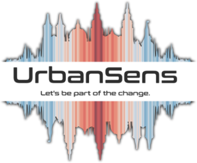

<!-- github-only:start -->
<div align="center">

<picture>
  <source media="(prefers-color-scheme: dark)" srcset="docs/img/logo/ulg-logo-on-dark.png">
  
</picture>

<br>

**Deutsch** · [English](README.en.md)

### [Dokumentation](https://urbansens.github.io/Urban-Landscape-Graphics/) · [Live-Demokarte](https://urbansens.github.io/Urban-Landscape-Graphics/demo/) · [Changelog](CHANGELOG.md) · [urbansens.de](https://urbansens.de/)

[Herkunft](https://urbansens.github.io/Urban-Landscape-Graphics/01-origins.html) ·
[Stilleitfaden](https://urbansens.github.io/Urban-Landscape-Graphics/02-style.html) ·
[Katalog](https://urbansens.github.io/Urban-Landscape-Graphics/03-catalog.html) ·
[Python](https://urbansens.github.io/Urban-Landscape-Graphics/04-python.html) ·
[GIS und Web](https://urbansens.github.io/Urban-Landscape-Graphics/05-gis-and-web.html) ·
[Standards](https://urbansens.github.io/Urban-Landscape-Graphics/06-standards.html) ·
[Lizenz und Nennung](https://urbansens.github.io/Urban-Landscape-Graphics/licence-and-credit.html)

[](https://github.com/UrbanSens/Urban-Landscape-Graphics/actions/workflows/ci.yml)
[](https://urbansens.github.io/Urban-Landscape-Graphics/)

</div>
<!-- github-only:end -->

**Der UrbanSens Ecological Vector Style als Bibliothek.** Ein Katalog aus Farben, leicht handgezeichneten
Texturen und Symbolen für Karten urbaner Landschaften (Rasen und Wiesen, Bäume, Wasser, Beläge, Flächennutzung,
Planungsstatus), verknüpft mit deutschen und europäischen Standards, dazu Renderer für Python und Exporter für
QGIS, GeoServer, MapLibre und Design-Tools.


```python
import ulg

ulg.element("wildflower_meadow").fill        # '#DADDBC': Farben nachschlagen, nie erfinden
ulg.resolve("osm", landuse="meadow", meadow="wildflower")    # 'wildflower_meadow'
ulg.resolve("alkis", objart="41008", funktion="4420")         # 'green_space'

gdf["element"] = ulg.classify(gdf, "osm")     # OSM, ALKIS, XPlanung, CORINE … → Elemente
ulg.render_svg(gdf, scale=500, path="plan.svg")         # druckfertiges SVG, maßstabsgetreu
ulg.render_svg(gdf, scale=1500, theme="planzv")         # dieselben Daten als Bauleitplan
ulg.indicators(ulg.flatten(gdf))              # Versiegelung, Biotopflächenfaktor, Abfluss, Baumkronenanteil
```

## Was es ist

- **173 Elemente** auf Englisch und Deutsch (Vegetation, Bäume, Wasser, Boden, 33 Oberflächen, Flächennutzung,
  Gebäude, Ausstattung, Grenzen, Planungs- und Analyse-Overlays), jedes mit einer Füllung, einer Textur pro
  Detailstufe, einem Linien- oder Punktsymbol, Aliasen und dokumentierten Kennwerten.
- **Ein Stil, der GIS-exakt bleibt.** Die Zeichen sind im Gelände verankert, nicht am einzelnen Objekt, sodass
  Muster über Polygongrenzen hinweg weiterlaufen und an Kachelgrenzen nahtlos anschließen; die handgezeichnete
  Kontur weicht nie um mehr als eine halbe Strichstärke von der wahren Kante ab.
- **26 Zuordnungstabellen (Crosswalks)** für OSM-Tags, ALKIS/NAK, XPlanung, PlanZV, basemap.de, LBM-DE, BKompV,
  BayKompV, FFH, die Berliner Biotopkarte, DIN 276, CORINE, Urban Atlas, CLC+, EUNIS, HILUCS, LUCAS, ESA WorldCover,
  LCZ sowie die nationalen Modelle der Niederlande, der Schweiz, Österreichs und Englands: 3926 Klassen, jede mit
  einem Passgrad.
- **Sieben Themes**: der sanfte Hausstil sowie PlanZV, ALKIS, basemap.de, BfN-Landschaftsplanung,
  OpenStreetMap Carto und eine Schwarz-Weiß-Zeichnung, mit den veröffentlichten Farbwerten.
- **Eingebaute Standards**: Statussymbole für Bäume nach ISO 11091 und PlanZV, Wurzelschutzbereiche nach
  DIN 18920, der Berliner Biotopflächenfaktor (BFF), Abfluss nach DIN 1986-100, das urbane Grün der Verordnung
  (EU) 2024/1991 zur Wiederherstellung der Natur (Nature Restoration Regulation, NRR), nach WCAG geprüfte
  Lesbarkeit einschließlich Farbsehschwächen.
- **Überall**: SVG und Matplotlib; QGIS (QML mit handgezeichneter Kontur und maßstabsabhängigem Detailgrad);
  OGC SLD; MapLibre-Sprites und -Layer mit Bäumen und Straßen in Metern; CSS- und DTCG-Design-Tokens; eine
  Kommandozeile; ein Skill für KI-Coding-Agenten.


## Installation

```bash
pip install "urban-landscape-graphics[all] @ git+https://github.com/UrbanSens/Urban-Landscape-Graphics"
```

Python 3.10+. Die Kernabhängigkeiten sind NumPy und Shapely; `[all]` ergänzt GeoPandas und Matplotlib. Die
PNG-Ausgabe nutzt `rsvg-convert`, CairoSVG oder Inkscape, sofern eines davon installiert ist. Prüfen Sie die
Installation:

```bash
ulg check
```

Um die Beispiele auszuprobieren oder an der Bibliothek zu arbeiten, verwenden Sie einen Klon:

```bash
git clone https://github.com/UrbanSens/Urban-Landscape-Graphics.git
cd Urban-Landscape-Graphics
pip install -e ".[dev]"
python examples/quickstart.py
```

## Dokumentation

<!-- github-only:start -->
**Online lesen: [urbansens.github.io/Urban-Landscape-Graphics](https://urbansens.github.io/Urban-Landscape-Graphics/)**,
mit Suche, Hell- und Dunkelmodus und einer
[Live-Demokarte](https://urbansens.github.io/Urban-Landscape-Graphics/demo/), die mit dem exportierten MapLibre-Stil gezeichnet ist.
Die Website gibt es auf Deutsch (Standard) und auf [Englisch](https://urbansens.github.io/Urban-Landscape-Graphics/en/).

| | Kapitel | Was Sie dort finden |
|---|---|---|
| 1 | [Herkunft](https://urbansens.github.io/Urban-Landscape-Graphics/01-origins.html) | vom Englischen Garten und der bayerischen Uraufnahme von 1808 bis zum GIS |
| 2 | [Der Stilleitfaden](https://urbansens.github.io/Urban-Landscape-Graphics/02-style.html) | Prinzipien, Palette, Texturen, Symbole, Zeichenreihenfolge, Lesbarkeit |
| 3 | [Der Katalog](https://urbansens.github.io/Urban-Landscape-Graphics/03-catalog.html) | alle Elemente und ihre Kennwerte |
| 4 | [Python](https://urbansens.github.io/Urban-Landscape-Graphics/04-python.html) | Zeichnen, Klassifizieren, Messen, die Kommandozeile |
| 5 | [GIS und Web](https://urbansens.github.io/Urban-Landscape-Graphics/05-gis-and-web.html) | QGIS, GeoServer, MapLibre, Tokens |
| 6 | [Standards](https://urbansens.github.io/Urban-Landscape-Graphics/06-standards.html) | woran sich der Stil hält, mit dem vollständigen [Standards-Bericht](https://urbansens.github.io/Urban-Landscape-Graphics/research/standards-report.html) |
| 7 | [Für KI-Agenten](https://urbansens.github.io/Urban-Landscape-Graphics/07-agents.html) | `ulg agent install` |
| 8 | [Erweitern des Stils](https://urbansens.github.io/Urban-Landscape-Graphics/08-extending.html) | wie der Stilleitfaden wächst |

Dieselben Seiten liegen als Markdown in [`docs/`](docs/index.md) vor und lassen sich daher auch hier auf GitHub lesen. Die
gesamte Dokumentation gibt es außerdem als eine einzige, in sich geschlossene Datei, [ulg-dokumentation.html](https://urbansens.github.io/Urban-Landscape-Graphics/ulg-dokumentation.html),
für den E-Mail-Versand und zum Offline-Lesen. GitHub baut die Website bei jedem Push; lokal:
`python tools/build_html.py`.
<!-- github-only:end -->
<!-- site-only
Beginnen Sie bei **[docs/index.md](docs/index.md)**:

1. [Herkunft](docs/01-origins.md): vom Englischen Garten und der bayerischen Uraufnahme von 1808 bis zum GIS
2. [Der Stilleitfaden](docs/02-style.md): Prinzipien, Palette, Texturen, Symbole, Zeichenreihenfolge, Lesbarkeit
3. [Der Katalog](docs/03-catalog.md): alle Elemente und ihre Kennwerte
4. [Python](docs/04-python.md): Zeichnen, Klassifizieren, Messen, die Kommandozeile
5. [GIS und Web](docs/05-gis-and-web.md): QGIS, GeoServer, MapLibre, Tokens
6. [Standards](docs/06-standards.md): woran sich der Stil hält, mit dem vollständigen [Standards-Bericht](docs/research/standards-report.md)
7. [Für KI-Agenten](docs/07-agents.md): `ulg agent install`
8. [Erweitern des Stils](docs/08-extending.md): wie der Stilleitfaden wächst
-->


## Repository

```text
src/ulg/          das Paket; src/ulg/data enthält Katalog, Palette, Themes und Crosswalks als JSON
docs/             Dokumentation (Deutsch, Englisch in docs/en), erzeugte Referenzseiten, Recherche
examples/         lauffähige Beispiele, Beispieldaten, eine MapLibre-Seite
tools/            Generatoren für Dokumentationsbilder, Logo, Referenzseiten und HTML; Daten-Formatierer
tests/            pytest-Suite
.github/          Tests und die Dokumentationsseite (GitHub Pages) laufen bei jedem Push
```

Mitarbeit an der Bibliothek: Die Regeln und Befehle stehen in [AGENTS.md](AGENTS.md) (für Menschen und
Coding-Agenten gleichermaßen) und im Kapitel [Erweitern des Stils](docs/08-extending.md).

## Lizenz und Nennung

`ulg` ist freie Software unter der **[MIT-Lizenz](docs/licence-and-credit.md#lizenz)**: Sie dürfen sie nutzen,
verändern und in kommerziellen Produkten ausliefern; der Lizenzhinweis muss beim Code bleiben. Die Karten und Blätter,
die Sie damit zeichnen, gehören Ihnen.

**Bitte nennen Sie uns.** Wenn `ulg` oder der UrbanSens Ecological Vector Style bei einer Karte, einem Plan, einem
Bericht, einer Ausschreibung oder einem Fachartikel geholfen hat, sagen Sie es in der Bildunterschrift oder im
Quellenverzeichnis:

> Kartenstil: UrbanSens Ecological Vector Style (ulg), [urbansens.de](https://urbansens.de/)
>
> Map style: UrbanSens Ecological Vector Style (ulg), [urbansens.de](https://urbansens.de/)

`ulg.credit_line()` liefert sie als Zeichenkette (mit Versionsnummer; `ulg.credit_line("en")` die englische Fassung). Die Stilblätter und die Katalogblätter (das Verzeichnis aller Elemente), die
`ulg` zeichnet, tragen in der Ecke ein kleines UrbanSens-Zeichen. Belassen Sie es, wenn Sie die Blätter weitergeben
(`credit=False` schaltet es ab); Ihre eigenen Karten erhalten nie einen Stempel. BibTeX, APA, die Regeln zu den Logos und
die Hinweise zu Material von Dritten: [Lizenz und Nennung](docs/licence-and-credit.md).
<!-- github-only:start -->
Die GitHub-Schaltfläche **Cite this repository** (neben der Dateiliste) liefert APA und BibTeX aus
[CITATION.cff](CITATION.cff); der Lizenztext steht in [LICENSE](LICENSE).
<!-- github-only:end -->

## Status

Version 0.1.0 (2026-09-30), [UrbanSens](https://urbansens.de/). Siehe [CHANGELOG.md](CHANGELOG.md). Die Standards wurden
am 30. September 2026 recherchiert; der [Standards-Bericht](docs/research/standards-report.md) nennt, was geprüft wurde,
was hinter einer Bezahlschranke liegt und was bei Änderungen der Standards erneut zu prüfen ist.

<!-- github-only:start -->
<br>

<div align="center">

<a href="https://urbansens.de/">
  <picture>
    <source media="(prefers-color-scheme: dark)" srcset="src/ulg/data/brand/urbansens-logo-on-white.png">
    
  </picture>
</a>

<sub>Ein Projekt von <a href="https://urbansens.de/">UrbanSens</a> · <a href="https://urbansens.de/">urbansens.de</a></sub>

</div>
<!-- github-only:end -->
