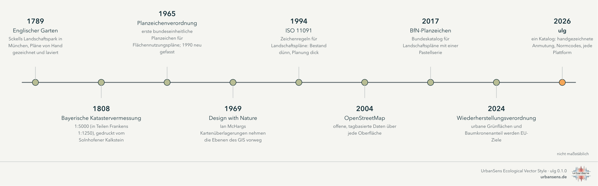
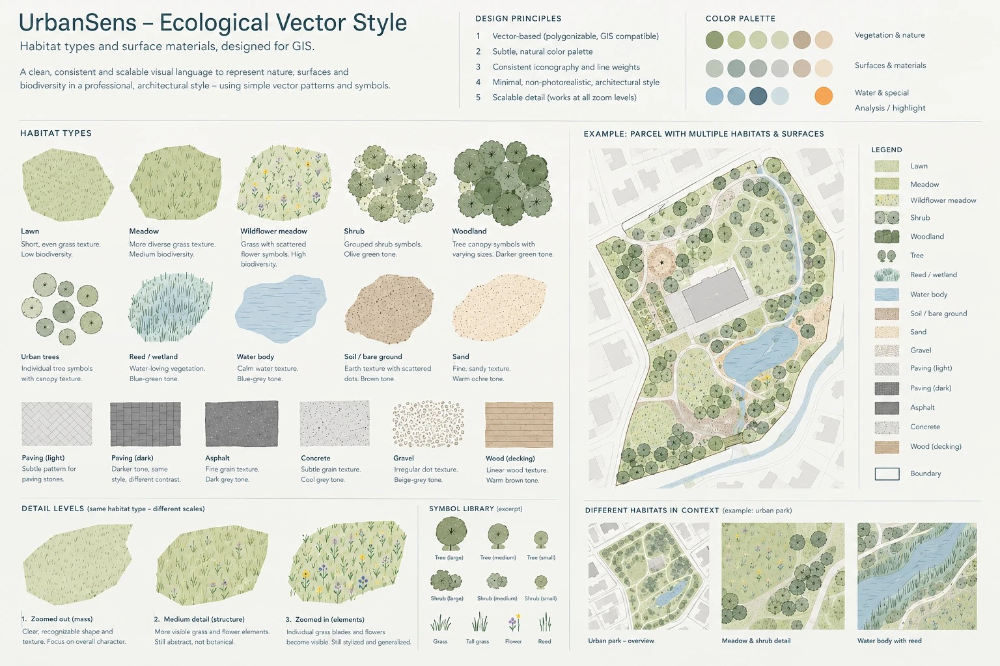
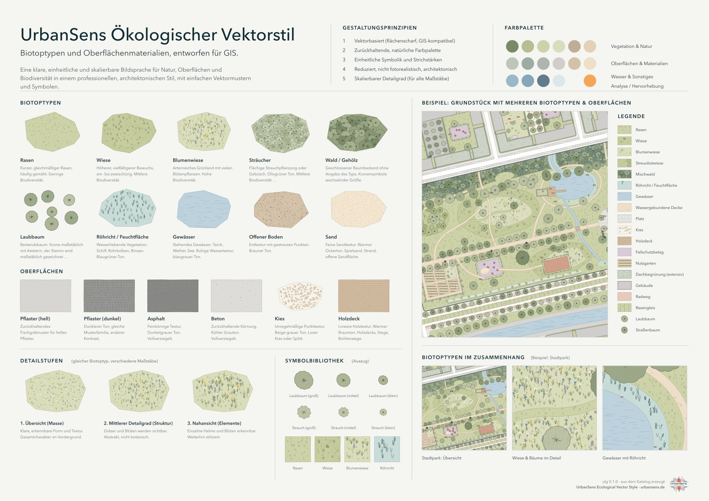
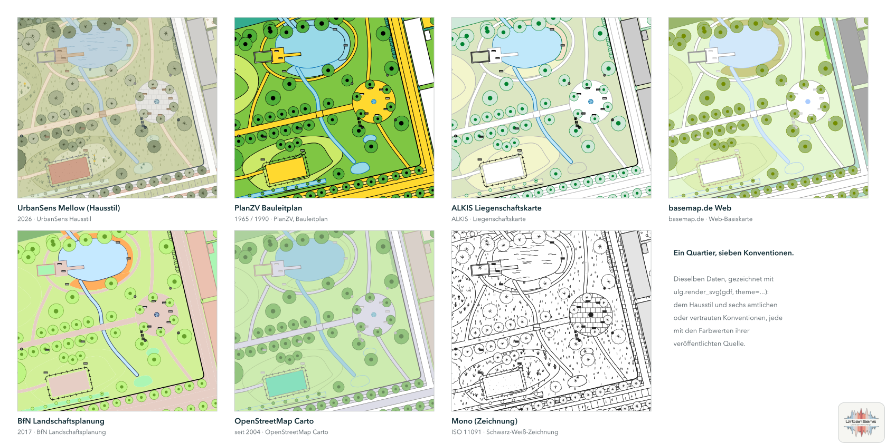

# 1 · Herkunft

*Woher die Anmutung dieses Stils kommt: zwei Jahrhunderte lavierter Gartenpläne, Vermessungsblätter und
Planzeichen, und warum eine Bibliothek der Weg ist, sie ins GIS zu übertragen.*

Landschaften wurden von Hand gezeichnet, lange bevor man sie am Computer kartierte. Die sanfte
Palette, die kleinen Büschel und Kronen und die ruhigen Konturen des UrbanSens-Stils sind keine
Erfindung; sie sind eine Auswahl aus einer Tradition, die in den Gartenplänen und Vermessungsämtern des
frühen 19. Jahrhunderts begann, mehrere davon in München, wo UrbanSens arbeitet.

---

## 1.1 Ein Park in Grün gemalt: München, 1789–1806

Im August 1789 verfügte Kurfürst Karl Theodor die Anlage eines öffentlichen Parks entlang der Isar in
München, auf Anregung von Benjamin Thompson, dem späteren Grafen Rumford. Friedrich Ludwig von Sckell
gestaltete ihn als Landschaftsgarten; er wurde 1792 eröffnet und ist mit 3,75 km² einer der größten
Stadtparks der Welt: der **Englische Garten**. Sckell leitete von 1804 bis zu seinem Tod 1823 die
Münchner Hofgärten.

  

*Ausschnitt aus dem Plan des Englischen Gartens, 1806: der Kleinhesseloher See, das Dorf Schwabing,
Wiesen und Baumgruppen. Königlich bayerische Direction des Topographischen Bureaus. Gemeinfrei,
über [Wikimedia Commons](https://commons.wikimedia.org/wiki/File:Kleinhesseloher_See_Plan_1806.jpg).*

Betrachten Sie die Farben dieses Blattes: blasse Grüntöne für die Wiesen, ein tieferes Grün für die
Wälder, klares Blau für das Wasser, Ziegelrot für die Dächer, alles auf warmem Papier.
Zweihundertzwanzig Jahre später arbeitet die UrbanSens-Palette mit denselben Verhältnissen: helle,
wenig gesättigte Füllungen, dunklere Zeichen im selben Farbton, gesättigte Farbe nur dort, wo etwas
Aufmerksamkeit verlangt.

*Der Monopteros im Englischen Garten, 26. Oktober 2014. Foto: Julian Herzog,
[CC BY 4.0](https://creativecommons.org/licenses/by/4.0), über
[Wikimedia Commons](https://commons.wikimedia.org/wiki/File:Monopteros_Englischer_Garten_Munich_2014_01.jpg).*

## 1.2 Stein, Tusche und Vermessung: die bayerische Uraufnahme, 1808–1864

In den 1790er-Jahren entdeckte Alois Senefelder, dass sich eine glatte Platte aus Solnhofener
Kalkstein, mit fetthaltiger Tusche beschrieben und angefeuchtet, zum Drucken eignet: die Lithografie.
Ab 1809 war er Inspektor des königlichen lithografischen Instituts in München, und die bayerische
Vermessung griff die neue Technik früh auf.

1808 begann Bayern mit der **Uraufnahme**, der ersten vollständigen Vermessung jedes Flurstücks im
Königreich, für die Grundsteuer. Die Vermessung erfolgte im Maßstab 1:5000, in Dörfern 1:2500 und in
Teilen Frankens sogar 1:1250. Mehr als 23 000 Blätter wurden gezeichnet, auf Kalksteinplatten gestochen
und gedruckt; die Steine werden bis heute vom Bayerischen Landesamt für Digitalisierung, Breitband und
Vermessung (LDBV) aufbewahrt.

*Ein Lithografiestein und der davon gezogene Abzug: eine alte Karte von München mit dem Hofgarten und
dem Englischen Garten, auf dem Stein spiegelverkehrt, wie es der Druck verlangt. Foto: Chris 73,
[CC BY-SA 3.0](https://creativecommons.org/licenses/by-sa/3.0), über
[Wikimedia Commons](https://commons.wikimedia.org/wiki/File:Litography_negative_stone_and_positive_paper.jpg).*

Die Zeichen wurden nicht frei gewählt. Die Instruktion von 1808 für die Steuervermessung schrieb für
jede Flächenart ein Zeichen vor, und sie liest sich wie der erste Entwurf eines Texturkatalogs:

  

*„Vorschrift zur Zeichnungsart für die Pläne der Steuer-Rectifications-Vermessung“: die Zeichenregeln
der bayerischen Steuervermessung nach der Instruktion von 1808. Königlich Bayerisches Vermessungsamt,
um 1840. Gemeinfrei, über
[Wikimedia Commons](https://commons.wikimedia.org/wiki/File:Legende_uraufnahme.pdf).*

Laub- und Nadelwälder, Gebüsch, Wiesen, moosige Wiesen, Weiden und Ödland, Moos, Gärten, Weinberge und
Hopfengärten haben jeweils ein eigenes kleines Zeichen; Gebäude, Grenzen, Wege, Flüsse und Brücken eine
eigene Linie. Ersetzen Sie *Wiesen* durch `meadow`, *Waldungen · Laubholz* durch `woodland_deciduous`
und *Gärten* durch `garden`, und diese Seite wird zu einer Legende des Katalogs aus
[Kapitel 3](03-catalog.md).

## 1.3 Kronen, Büschel und Lavierungen: die Sprache der Gartenpläne

Wer Landschaften entwarf, zeichnete mit denselben Mitteln. In Peter Joseph Lennés Plan für den
Berliner Tiergarten sind die Wälder aus Tausenden kleiner Kronen aufgebaut, die offenen Rasenflächen
behalten den Papierton und die Wege bleiben weiß.

*„Verschönerungs-Plan“ für den königlichen Tiergarten in Berlin von Peter Joseph Lenné, gezeichnet von
Gerhard Koeber in Feder, Bleistift und Aquarell, 1835. Landesarchiv Berlin. Gemeinfrei, über
[Wikimedia Commons](https://commons.wikimedia.org/wiki/File:Tiergarten-Plan_von_Lenn%C3%A9,_1835_-03.jpg).*

Ländliche Karten folgten Konventionen, die allen Lesenden vertraut waren. Die Archivbeschreibung dieser
handgezeichneten Karte aus Württemberg nennt sie: Häuser rot, Äcker braun, Weinberge mit Rebsymbolen,
Wiesen grün, Wälder als Baumsymbole, Wege braun, die Flüsse blau (gezeichnet „nach dem Aug und freier
Faust“).

*Plan des Enzberger Jagddistrikts und der Markung, handgezeichnet, undatiert. Landesarchiv
Baden-Württemberg, Hauptstaatsarchiv Stuttgart N 3 Nr. 47, [CC BY 4.0](https://creativecommons.org/licenses/by/4.0),
über [Wikimedia Commons](https://commons.wikimedia.org/w/index.php?curid=174709525).*

> der nach dem Aug und freier Faust ist gezeichnet worden
>
> Quelle: Ende des Titels des Enzberger Plans, Landesarchiv Baden-Württemberg, Hauptstaatsarchiv Stuttgart N 3 Nr. 47

Drei Gewohnheiten dieser Zeichnungen wurden zu Regeln des Stils: **Zeichen entstehen von Hand, werden
aber mit Sorgfalt platziert** (das Konturwackeln verdeckt nie die wahre Kante); **Textur sagt, was eine
Oberfläche ist** (Kronen für Bäume, Büschel für Wiese, Wellen für Wasser); und **Farbe bleibt ruhig**,
damit der Plan eine Aussage tragen kann.

## 1.4 Von Farbwörtern zu Schlüsseln: das 20. Jahrhundert

Das Planungsrecht machte aus Konventionen Regeln. Die **Planzeichenverordnung** (PlanZV) legte
am 19. Januar 1965 erstmals bundeseinheitliche Planzeichen für Flächennutzungs- und Bebauungspläne
fest; die geltende Fassung stammt vom 18. Dezember 1990 und wurde zuletzt am 12. August 2025
geändert. Sie benennt ihre Farben nur in Worten (*Grün mittel*, *Blau mittel*) und liefert eine der
nützlichsten Regeln für Vegetationssymbole: Ein **offenes** Zentrum kennzeichnet einen anzupflanzenden
Baum, ein **gefülltes** Zentrum einen zu erhaltenden Baum (Nr. 13.2).

> Die Planzeichen sollen in Farbton, Strichstärke und Dichte den Planunterlagen so angepaßt werden, daß deren Inhalt erkennbar bleibt.
>
> Quelle: Planzeichenverordnung 1990, § 2 Abs. 3

1969 schichtete Ian McHargs *Design with Nature* transparente Karten von Böden, Wasser, Hangneigungen
und Vegetation übereinander, um herauszufinden, wo Bauen am wenigsten schadet: die Überlagerungskarte,
die Geoinformationssysteme zur Routine machten. Die internationale Norm für Landschaftszeichnungen,
**ISO 11091** (1994), regelte, wie Pläne *Bestand* von *Planung* unterscheiden: dünne Linien für das
Vorhandene, dicke Linien für das Geplante. Das Liegenschaftskataster wurde digital: mit dem Modell
**ALKIS** der deutschen Vermessungsverwaltungen, seinen Objektarten und seinem Signaturenkatalog.

## 1.5 Offene Daten und ökologische Ziele: das 21. Jahrhundert

Seit 2004 beschreibt **OpenStreetMap** die Erdoberfläche in offenen Tags (`landuse=meadow`,
`surface=gravel`, `natural=tree`), und sein Carto-Stil machte sie zu einer gemeinsamen Bildsprache. 2017
veröffentlichte das Bundesamt für Naturschutz (BfN) einen Planzeichenkatalog für Landschaftspläne: helle
Farbtöne ohne Kontur für Flächen von geringer bis mittlerer Wertigkeit, gesättigte Farben mit schwarzer
Kontur für Flächen von hoher Wertigkeit und braune senkrechte Striche für Brachen. Diese Konvention
übernimmt der Stil.

2024 machte die **Verordnung (EU) 2024/1991 zur Wiederherstellung der Natur** (Nature Restoration
Regulation, NRR) urbanes Grün und den Baumkronenanteil zu einem rechtlich verbindlichen Ziel: kein
Nettoverlust bis 2030 gegenüber 2024 und ab 2031 ein steigender Trend, gemessen mit Copernicus-Daten.
Was eine Karte als Grün zeigt, ist nun auch das, worüber eine Stadt berichtet.

> Die Mitgliedstaaten stellen bis zum 31. Dezember 2030 sicher, dass in städtischen Ökosystemgebiete[n] […] kein Nettoverlust an der nationalen Gesamtfläche städtischer Grünflächen und städtischer Baumüberschirmung gegenüber 2024 zu verzeichnen ist.
>
> Quelle: Verordnung (EU) 2024/1991 (Verordnung zur Wiederherstellung der Natur), Artikel 8 Absatz 1

## 1.6 2026: ein Katalog

UrbanSens hat die gewünschte Bildsprache für seine Karten auf einem Blatt festgehalten: Biotoptypen und
Oberflächenmaterialien in einem klaren, sanften, leicht handgezeichneten Vektorstil, der in jedem
Maßstab funktioniert.

> Eine klare, einheitliche und skalierbare Bildsprache für Natur, Oberflächen und Biodiversität in einem professionellen, architektonischen Stil, mit einfachen Vektormustern und Symbolen.
>
> Quelle: UrbanSens, Referenzblatt des Ecological Vector Style (Übersetzung)

<table>
<tr>
<td width="50%"></td>
<td width="50%"></td>
</tr>
<tr>
<td><em>Die Vorgabe: das UrbanSens-Referenzblatt für den Ecological Vector Style.</em></td>
<td><em>Das Ergebnis: dasselbe Blatt, mit <code>ulg sheet</code> aus dem Katalog erzeugt.</em></td>
</tr>
</table>

`ulg` macht aus diesem Blatt eine Bibliothek. Sie behält die Anmutung (ruhige Farben, Texturen, die
sagen, was eine Oberfläche ist, maßstabsgerecht gezeichnete Bäume) und verknüpft jedes Element mit den
Konventionen, die dieses Kapitel nachgezeichnet hat: den Schlüsseln aus ALKIS, XPlanung, den
Biotoplisten und OpenStreetMap, den Bestands- und Planungssymbolen von PlanZV und ISO 11091, den
Kennwerten, die Planende ausweisen, und den amtlichen Farben der jeweiligen Konvention, wenn eine Karte
ihr folgen muss.

*Ein Quartier, sieben Konventionen: das Demoquartier im Hausstil und in sechs amtlichen oder vertrauten
Konventionen, aus denselben Daten.*

---

### Bildnachweise

| Bild | Urheberschaft, Datum | Lizenz | Quelle |
|---|---|---|---|
| Plan des Englischen Gartens (Ausschnitt) | Königlich bayerische Direction des Topographischen Bureaus, 1806 | gemeinfrei | [Commons](https://commons.wikimedia.org/wiki/File:Kleinhesseloher_See_Plan_1806.jpg) |
| Monopteros, Englischer Garten | Julian Herzog, 2014 | [CC BY 4.0](https://creativecommons.org/licenses/by/4.0) | [Commons](https://commons.wikimedia.org/wiki/File:Monopteros_Englischer_Garten_Munich_2014_01.jpg) |
| Lithografiestein und Abzug | Chris 73, 2006 | [CC BY-SA 3.0](https://creativecommons.org/licenses/by-sa/3.0) | [Commons](https://commons.wikimedia.org/wiki/File:Litography_negative_stone_and_positive_paper.jpg) |
| Zeichenregeln der bayerischen Steuervermessung | Königlich Bayerisches Vermessungsamt, um 1840 | gemeinfrei | [Commons](https://commons.wikimedia.org/wiki/File:Legende_uraufnahme.pdf) |
| Tiergarten-Plan | Peter Joseph Lenné (Entwurf), Gerhard Koeber (Zeichnung), 1835; Landesarchiv Berlin | gemeinfrei | [Commons](https://commons.wikimedia.org/wiki/File:Tiergarten-Plan_von_Lenn%C3%A9,_1835_-03.jpg) |
| Plan des Enzberger Jagddistrikts | unbekannt, undatiert; Landesarchiv Baden-Württemberg, HStA Stuttgart N 3 Nr. 47 | [CC BY 4.0](https://creativecommons.org/licenses/by/4.0) | [Commons](https://commons.wikimedia.org/w/index.php?curid=174709525) |
| Zeitleiste, Referenzblatt, Stilblatt, Konventionen | UrbanSens / mit `ulg` erzeugt | keine | dieses Repository |

Die historischen Bilder sind von Wikimedia Commons verlinkt und nicht in das Repository kopiert; zur
Anzeige brauchen sie eine Internetverbindung.

---

Weiter: [2 · Der Stilleitfaden](02-style.md)
