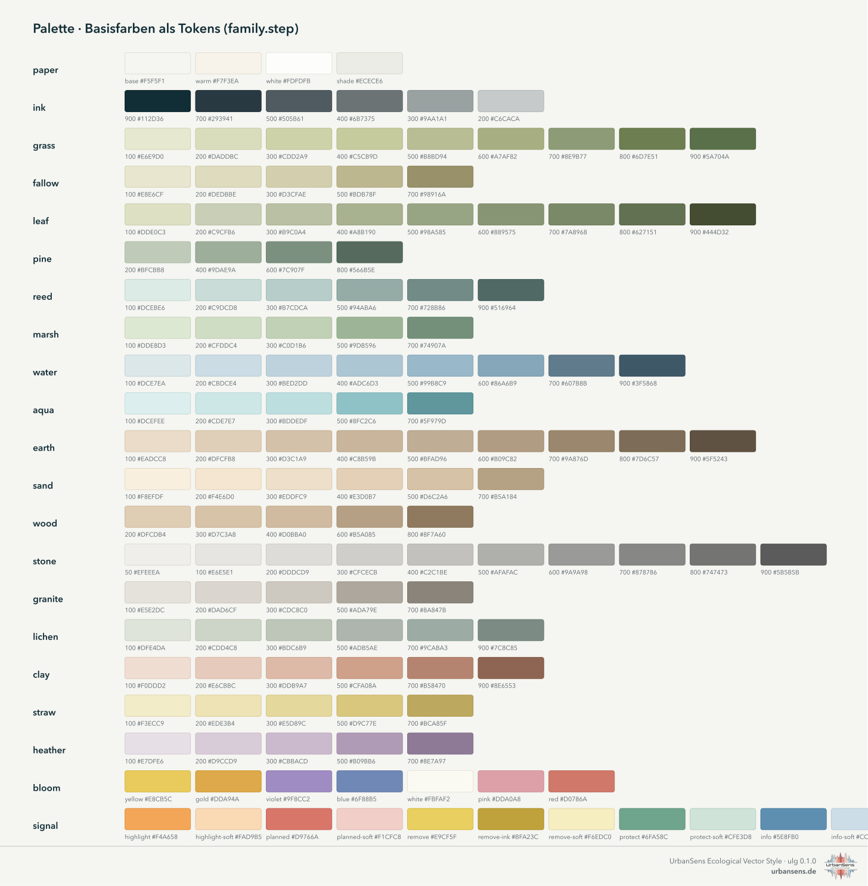
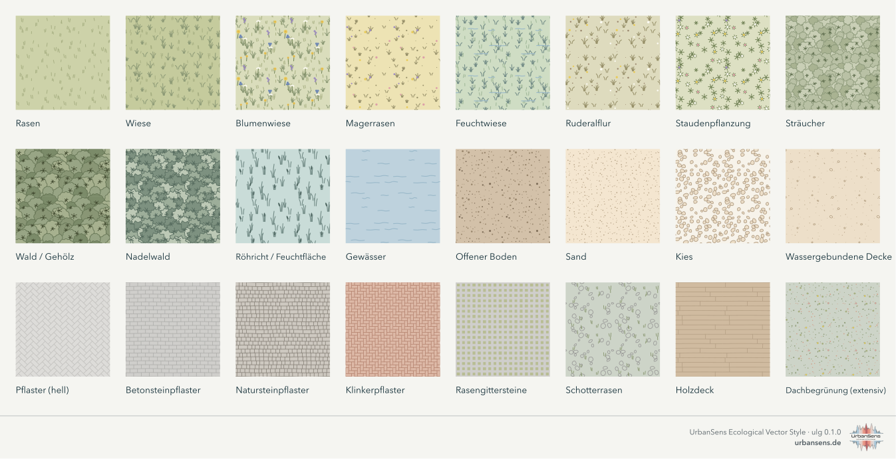
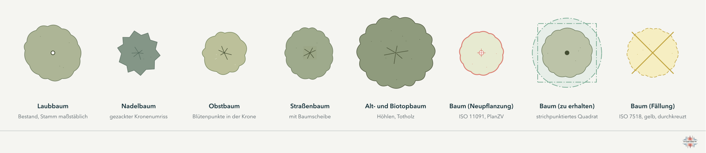
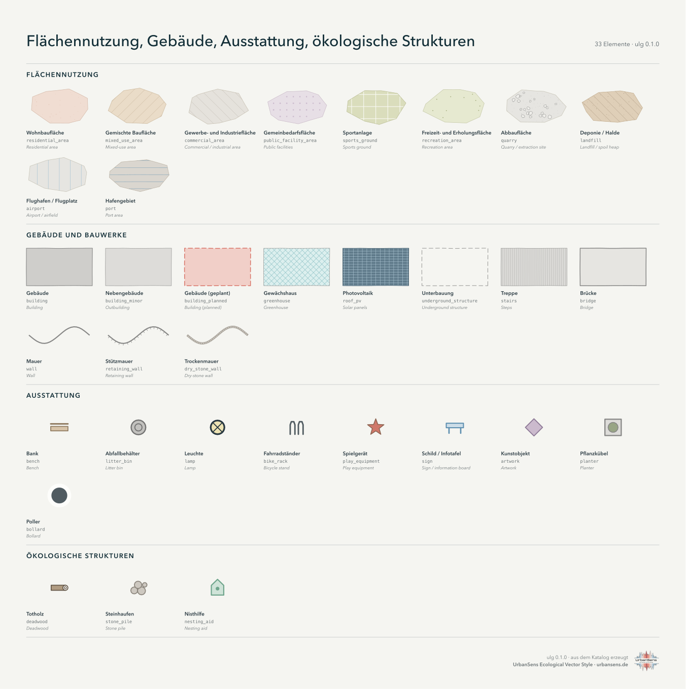
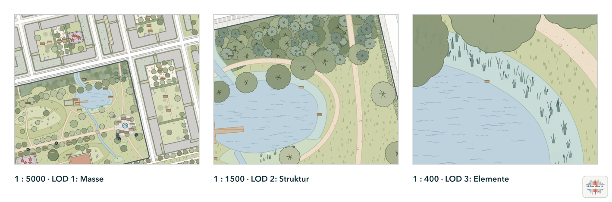
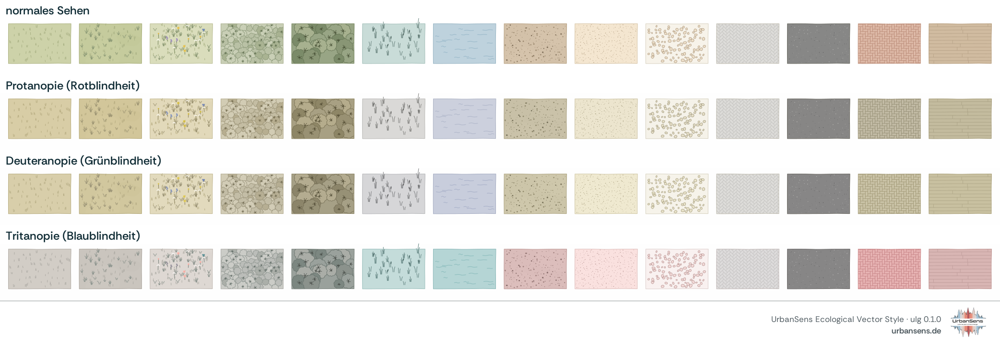

# 2 · Der Stilleitfaden

*Die Regeln des UrbanSens Ecological Vector Style: wie eine Karte in diesem Stil aussieht und warum.*


Das Blatt oben ist keine Zeichnung des Stils, sondern sein Produkt: `ulg sheet` rendert es aus denselben
Daten, nach denen Ihre Karten gestaltet werden, sodass Leitfaden und Karten nicht auseinanderdriften können.
Die englische Fassung ist [`img/style-sheet.png`](img/style-sheet.png).

---

## 2.1 Fünf Prinzipien

Das Referenzblatt von UrbanSens nennt fünf Gestaltungsprinzipien. Die Bibliothek macht jedes davon überprüfbar:

> Vektorbasiert (flächenscharf, GIS-kompatibel) · Zurückhaltende, natürliche Farbpalette · Einheitliche Symbolik und Strichstärken · Reduziert, nicht fotorealistisch, architektonisch · Skalierbarer Detailgrad (für alle Maßstäbe)
>
> Quelle: UrbanSens, Referenzblatt des Ecological Vector Style, „Gestaltungsprinzipien“ (Übersetzung)

| # | Prinzip | Was es in der Praxis bedeutet |
|---|---|---|
| 1 | **Vektorbasiert, GIS-exakt** | Jedes Zeichen ist ein Vektorpfad, der aus der Geometrie des Objekts berechnet wird. Die Polygone bleiben die Polygone Ihrer Daten: Das handgezeichnete Konturwackeln verschiebt nur die *gezeichnete* Kontur, und zwar nie um mehr als die halbe Strichstärke (0,09 mm bei der Standardkontur von 0,18 mm), sodass die Tinte stets die wahre Kante überdeckt. |
| 2 | **Zurückhaltende, natürliche Palette** | Hohe Helligkeit, geringe Buntheit, warmes Papier. Farben stammen aus benannten Tokens der Palette (`grass.300`), nie aus ad hoc eingesetzten Hex-Werten. |
| 3 | **Einheitliche Symbolik und Strichstärken** | Eine Reihe von Strichstärken (ISO 128: 0,13 · 0,18 · 0,25 · 0,35 · 0,5 · 0,7 · 1,0 mm), eine Regel für Konturen, eine Symbolgrammatik für Bäume und Status. |
| 4 | **Reduziert, nicht fotorealistisch** | Texturen sind abstrakte Zeichen (Büschel, Striche, Kronen, Kiesel, Wellen), die sagen, *was* eine Oberfläche ist, und nicht, wie ein Foto von ihr aussieht. |
| 5 | **Skalierbarer Detailgrad** | Vier Detailstufen folgen dem Kartenmaßstab. Eine Wiese ist bei 1:20 000 eine getönte Fläche, bei 1:5000 sind es Büschel und bei 1:500 einzelne Halme und Blüten. |

## 2.2 Farbe



Die Palette hat 21 Farbfamilien mit Basisfarben, die als `family.step` angesprochen werden. Elemente, Themes und
Exporter verweisen nur auf Tokens; ein geändertes Token ändert jede Karte, jedes Blatt und jeden Export auf einmal.

| Farbfamilie | Rolle |
|---|---|
| `paper` | Seiten- und Kartenhintergrund (`paper.base` #F5F5F1), Weiß, Schattierton |
| `ink` | Text, Konturen, Grenzen (`ink.900` #112D36 bis `ink.200`) |
| `grass`, `fallow` | Rasen, Wiesen, Weiden, Brachflächen und trockenes Gras |
| `leaf`, `pine` | Sträucher und Laubbaumkronen; Nadelbäume |
| `reed`, `marsh`, `lichen` | Röhricht und Feuchtflächen; Feuchtwiesen; Graugrüntöne (Salzwiese, durchlässige Oberflächen) |
| `water`, `aqua` | natürliche Gewässer; Pools, Becken und andere künstlich angelegte Gewässer |
| `earth`, `sand`, `wood` | Boden, Mulch; Sand und wassergebundene Decken; Holzdecks und Bauholz |
| `stone`, `granite`, `clay` | Beläge, Beton, Gebäude; Naturstein und Gewerbeflächen; Klinker, Tennenbeläge, Wohnbauflächen |
| `straw`, `heather`, `bloom` | Äcker und Wechselflor; Heide und Gemeinbedarfsflächen; Blütenakzente |
| `signal` | Planungsstatus und Analyse: `highlight` orange, `planned` rot, `remove` gelb, `protect` grün, `info` blau, jeweils mit einer `-soft`-Tönung |

**Regeln**

- Flächen verwenden die hellen Stufen (100–400); Texturzeichen verwenden dunklere Stufen derselben Familie
  (600–900), damit eine Textur stets als Teil ihrer Oberfläche wirkt.
- Konturen entstehen, indem die Füllung um einen festen Betrag abgedunkelt wird (`settings.json → outline_darken`),
  sofern ein Element keine eigene festlegt.
- Gesättigte Farbe ist der Bedeutung vorbehalten: Die Familie `signal` kennzeichnet, was geplant, entfernt,
  geschützt oder hervorgehoben ist. Verwenden Sie sie nie für Landbedeckung.
- Benachbarte Landbedeckungen müssen sich in der Farbe um mindestens ΔE₀₀ 10 unterscheiden, andernfalls in Textur
  oder Kontur (geprüft von `ulg check`, siehe 2.8).

Für Analyse-Layer gibt es fertige Farbverläufe und Klassenpaletten im selben Tonwertbereich:

| Name | Art | Verwendung |
|---|---|---|
| `heat`, `cool`, `vitality`, `biodiversity`, `sealing` | sequenziell | Wärmebelastung, Kühlung und Schatten, Vegetationsvitalität, Biodiversitätswert, Versiegelungsgrad |
| `diverging` | divergierend | Veränderung und Abweichung |
| `klimatop` | Klassen | Klimatope mit den Klassennamen der VDI 3787 Blatt 1 (Hausfarben in der üblichen Farbtonfolge) |
| `utci`, `pet` | Klassen mit Grenzwerten | Klassen des thermischen Komforts (10 UTCI-Klassen, 9 PET-Klassen) |

```python
ulg.ramp("heat", 5)                  # ['#F7F1DC', '#F6D5A5', '#EFAC77', '#DB805F', '#B5574F']
ulg.category_of("utci", 34.2)        # {'id': 'strong_heat', 'min': 32, 'max': 38, 'color': '#F0B273', ...}
```

## 2.3 Texturen



Siebzehn *Texturmotive* zeichnen jede Oberfläche. Jedes Element wählt ein oder zwei Motive und deren Zeichenfarben
aus der Palette:

| Motiv | Zeichen | Verwendet z. B. für |
|---|---|---|
| `grass_ticks` | kurze, schräg stehende Striche | Rasen, Golfplatz |
| `grass_tufts` | Halmbüschel | Wiese, Heide, Moor, Salzwiese, Düne |
| `flowers` | kleine Blütenköpfe auf Stielen | Blumenwiese, Blühstreifen, Heide |
| `reeds` | aufrechte Halme mit Köpfen | Röhricht, Seggenried |
| `canopy` | gelappte Kronen mit Aststern | Wald, Feldgehölz, Streuobstwiese, Hutewald |
| `rosettes` | kleine sternförmige Pflanzen und Punkte | Staudenpflanzungen, Dachbegrünungen, Freizeit- und Erholungsflächen |
| `rows` | Pflanzreihen mit Einzelpflanzen | Rebfläche, Nutzgarten, Kleingärten, Gartenbau |
| `waves` | kurze Wellenstriche | Gewässer, Gewässer in Feuchtgebieten, Watt |
| `stipple` | Punkte unterschiedlicher Größe | Sand, offener Boden, Düne, Watt, Betonkorn |
| `pebbles` | umrandete Steine | Kies, Fels, Bunker, Schwimmblätter |
| `chips` | kurze Splitter | Holzhäcksel, Rindenmulch |
| `bond`, `herringbone`, `cells` | Pflasterfugen und Raster | Betonsteinpflaster, Natursteinpflaster, Plattenbeläge, Klinkerpflaster, Rasengittersteine, Photovoltaik |
| `hatch` | parallele Linien, wahlweise gekreuzt | Flächennutzungen, Sportanlagen, Flughäfen, Schnee und Eis, Planungs-Overlays |
| `stripes` | exakte Streifen | gemähter Sportrasen, Bahnen der Laufbahn |
| `wash` | schwache Tonwertunterschiede | die Aquarellwirkung großer Vegetationsflächen |

**Wie sich Texturen verhalten**

- **Am Boden verankert.** Die Positionen der Zeichen werden aus Bodenkoordinaten abgeleitet, nicht aus dem
  Objekt. Zwei benachbarte Polygone desselben Elements setzen das Muster des jeweils anderen fort, und eine
  verschobene oder in Kacheln zerlegte Karte zeigt dieselben Zeichen an denselben Stellen.
- **Nahtlose Kacheln.** Für QGIS, SLD und das Web werden dieselben Motive in periodische Kacheln gezeichnet,
  die sich nahtlos wiederholen.
- **Auf die eigene Fläche beschnitten.** Kronen und Zeichen ragen nie über den Objektrand hinaus, sodass die
  Zeichenreihenfolge das Aussehen sauberer Daten nie verändert.
- **Dichte nach Detailstufe** (2.6), nicht nach Objektgröße, sodass eine Textur auf einem kleinen und einem
  großen Polygon gleich aussieht.

## 2.4 Linien

Linienelemente verwenden die Reihe nach ISO 128 aus `settings.json → line_weights`: `hair` 0,13, `fine` 0,18,
`regular` 0,25, `medium` 0,35, `bold` 0,5, `heavy` 0,7, `extra` 1,0 mm. Texturzeichen werden absichtlich feiner
gezeichnet als die feinste Kontur: Sie dürfen nie mit einer Grenze konkurrieren.

| Linie | Aussehen | Grundlage |
|---|---|---|
| Flächenkontur | 0,18 mm, abgedunkelte Füllung, leichtes Konturwackeln | Hausregel |
| Grundstücksgrenze / Flurstücksgrenze | dunkel durchgezogen / dünn grau | Plankonventionen |
| Grenze des Geltungsbereichs | kräftiges, gestricheltes, dunkles Band | PlanZV 15.13 (Schwarz-Weiß-Form) |
| Maßnahmenfläche Natur (SPE) | Rand mit nach innen weisenden T-Strichen | PlanZV 13.1 |
| Flächen zum Anpflanzen / mit Erhaltungsbindung | Rand mit offenen Kreisen / gefüllten Punkten auf der Innenseite | PlanZV 13.2.1 / 13.2.2 |
| Schutzgebietsgrenze | grüne Strichpunktlinie | Hauskonvention (PlanZV 13.3 verwendet Strichgruppen) |
| Wurzelschutzbereich | grüne Strichpunktlinie mit heller Tönung | Geometrie nach DIN 18920, Schutzlinie nach ISO 11091 |
| Zaun, Stützmauer, Böschung, Höhenlinie | kleine Kreuze, Striche auf der höheren Seite, Schraffen, feine braune Linien | topografische Konventionen |

Linien sowie Straßen oder Wege, die als **Mittellinien** vorliegen (OpenStreetMap-Highways), werden über der
gesamten Landbedeckung gezeichnet. Flächenelemente wie Fahrbahnen und Gehwege werden zu Streifen in ihrer
tatsächlichen Breite (siehe 2.7).

## 2.5 Symbole



**Bäume werden maßstäblich gezeichnet.** Eine Krone ist eine gelappte Kontur im tatsächlichen Durchmesser des
Baums (Attribut `crown_diameter` oder der Standardwert des Elements), ab 1:1500 und größer mit einem Aststern.
Ist ein Stammdurchmesser oder Stammumfang (`stammumfang` in cm) bekannt, wird auch der Stamm maßstäblich gezeichnet.

**Der Status folgt den Standards.** Eine Grammatik gilt für alle Planzeichnungen:

| Status | Element | Darstellung | Quelle |
|---|---|---|---|
| Bestand | `tree` … | dünne Kontur, Aststern | ISO 11091 (Bestand = dünn) |
| Neupflanzung | `tree_planned`, `shrub_planned` | kräftige rote Kontur, kleines Kreuz in einem offenen Ring | ISO 11091 (geplant = kräftig, Mittelkreuz); PlanZV 13.2 (offene Mitte = anpflanzen) |
| Erhalt | `tree_protected` | gefüllte Mitte, quadratischer Rahmen aus Strichpunktlinie, Wurzelschutzbereich | PlanZV 13.2 (gefüllt = erhalten); Schutzrahmen nach ISO 11091 |
| Fällung | `tree_remove` | gestrichelte gelbe Kontur mit Kreuz | ISO 11091 (Beseitigung); Farben der bayerischen Bauvorlagen (Bestand grau, neu rot, Beseitigung gelb) |

Der Wurzelschutzbereich (`ulg.root_protection_zone()`) ist nach DIN 18920 die Kronentraufe plus 1,50 m
(bei säulenförmigen Bäumen plus 5,00 m); der Mindestabstand für Gräben beträgt das Vierfache des Stammumfangs,
mindestens 2,50 m.

**Piktogramme** kennzeichnen Ausstattung und ökologische Strukturen (Bank, Abfallbehälter, Leuchte, Fahrradständer,
Schild, Spielgerät, Pflanzkübel, Poller, Totholz, Steinhaufen, Nisthilfe …). Sie werden in fester Papiergröße
gezeichnet, bleiben so in jedem Maßstab lesbar und werden in Legenden und Blättern automatisch vergrößert.



## 2.6 Detailstufen



| LOD | Maßstab | Was gezeichnet wird |
|---|---|---|
| 3 | 1:750 und größer | einzelne Halme, Blüten, Kiesel, Kronen mit Stämmen; Planzeichnungen |
| 2 | 1:750 bis 1:2500 | Büschel, Gruppen, Kronen mit Aststernen; Lagepläne und Parkkarten |
| 1 | 1:2500 bis 1:10 000 | feine, spärliche Zeichen, vereinfachte Kronen; Stadtteilkarten |
| 0 | kleiner als 1:10 000 | einfarbige Flächen; Stadtkarten und Übersichten |

`ulg.lod_for_scale(500)` → 3, `ulg.lod_for_zoom(18)` → 2. Geben Sie den Maßstab an und schalten Sie Texturen nicht
von Hand aus.

## 2.7 Zeichenreihenfolge

Reale Daten sind oft *gestapelt*: OpenStreetMap erfasst einen Park als ein Polygon, den Rasen, den Teich und die
Wege darin als weitere Polygone darüber. Der Stil zeichnet in Bändern, damit gestapelte Daten richtig aussehen und
saubere Daten davon unberührt bleiben:

| z | Band | Elemente |
|---|---|---|
| 1–5 | Rückfallebene, Umgebung | `unknown`, graue Gebäude der Umgebung, Straßen, Grün und Gewässer |
| 20 | **Boden**, größte zuerst gezeichnet | Flächennutzungen und Komplexe (Wohnbauflächen, Parks, Friedhöfe, Spielplätze, Flughäfen …), Rasen, Wiesen, Pflanzungen, Wald, Äcker, offener Boden, Sand, alle befestigten und losen Oberflächen |
| 30–33 | Gewässer, dann was auf dem Wasser liegt | Teiche, Flüsse, Wasserbecken; Watt; Röhricht, Sumpf, Schwimmblätter; Holzdecks und Stege |
| 35 | Linien und Mittellinienstreifen | Wege, Straßen, Bäche und Gräben, die als Linien vorliegen |
| 50–66 | Hecken und Bauwerke | Hecken, Brücken, Treppen, Gebäude, Dachbegrünungen, Photovoltaik, Mauern |
| 66–76 | Bäume und Punkte | Kronen, Ausstattung, ökologische Strukturen |
| 84–98 | Overlays | Grenzen, Planung, Analyse |

Innerhalb des Bodenbands werden **kleinere Flächen über größeren gezeichnet**, nach der Regel, die OpenStreetMap
Carto für die Landbedeckung verwendet. Ein Spielplatz im Park, ein Rasen, der den Park überdeckt, eine Wiese im
Rasen und eine Lichtung im Wald bleiben alle sichtbar, und ein Komplex wie ein Park verdeckt nie die darin
kartierten Oberflächen. Gewässer liegen über dem Bodenband, weil Teiche regelmäßig überlagernd zu Parks und Wäldern
kartiert werden. `ulg.flatten()` wendet dieselbe Reihenfolge auf die Geometrie selbst an und macht aus gestapelten
Daten eine saubere Partition für Flächenstatistiken.

## 2.8 Lesbarkeit



`ulg check` (und die Testsuite) erzwingt drei Regeln:

1. **Unterscheidbar.** Zwei Landbedeckungen mit einem Farbabstand von weniger als ΔE₀₀ 10 müssen sich in Textur
   oder Kontur unterscheiden. Paare, die sich in nichts unterscheiden, sind Fehler.
2. **Sicher bei Farbsehschwäche.** Derselbe Test wird nach der Simulation von Protanopie, Deuteranopie und
   Tritanopie wiederholt (Machado et al. 2009). Die Bedeutung hängt nie allein vom Farbton ab (WCAG 2,
   Erfolgskriterium 1.4.1).
3. **Zeichen mit Kontrast.** Texturzeichen werden gegen ihre Füllung gemessen; der Bericht führt die schwächsten
   auf, und Symbole und Grenzen folgen WCAG 1.4.11 zum Nicht-Text-Kontrast.

## 2.9 Typografie und Layout

Blätter, Legenden und Titel verwenden eine humanistische Sans-Serif-Schrift (Avenir Next, ersatzweise Nunito Sans,
Source Sans 3, Helvetica Neue, Arial), `ink.900` für Titel und `ink.500` für nachrangigen Text, Kapitälchen mit
weiter Laufweite für Abschnittsüberschriften und dünne Linien in `ink.200`. Karten werden im gewählten Maßstab in
Papiermillimetern angelegt.

## 2.10 Themes: dieselbe Karte in anderen Konventionen


Der Hausstil ist `mellow`. Sechs weitere Themes zeichnen dieselben Daten in einer amtlichen oder vertrauten
Konvention, mit den Farbwerten der veröffentlichten Quelle: `planzv` (Flächennutzungs- und Bebauungspläne),
`alkis` (Liegenschaftskarte), `basemap` (basemap.de), `bfn` (Landschaftsplanung), `osm` (OpenStreetMap
Carto) und `mono` (Schwarz-Weiß-Zeichnung nach ISO 11091). Amtliche Themes verwenden einfarbige Flächen und
exakte Linien. Quellen und Belege: [Standards](06-standards.md#62-themes) und
[reference/themes.md](reference/themes.md).

## 2.11 Richtig und falsch

| Richtig | Falsch |
|---|---|
| Ein Element nachschlagen (`ulg.find("Schotterrasen")`) | Für eine Oberfläche, die es im Katalog gibt, eine Farbe oder Textur erfinden |
| Externe Daten mit einer Zuordnungstabelle (Crosswalk) klassifizieren | Schlüssel von Hand Farben zuordnen |
| Den Kartenmaßstab angeben | Texturen von Hand ein- oder ausschalten |
| Den Planungsstatus in den Statuselementen führen | Einen geplanten Baum grün färben, weil er später grün sein wird |
| `signal`-Farben nur für Bedeutung verwenden | Orange oder Rot für Landbedeckung verwenden |
| `unknown`-Objekte an der Quelle korrigieren | Nicht klassifizierte Objekte ausblenden |
| In einem metrischen CRS arbeiten (EPSG:25832 in Bayern) | In Grad messen oder texturieren |

## 2.12 Das Zeichen

Das Logo buchstabiert *ulg* mit drei Dingen aus einem Landschaftsplan, die die Bibliothek jeweils aus einem
Katalogelement zeichnet: ein **Teich** in Form eines *u* (`water`), ein **baumgesäumter Weg** als *l* (`waterbound`
und `tree`) und eine **Baumkrone mit Bach** als Unterlänge des *g* (`tree` und `watercourse`). Die handgezeichnete
Kontur und die Texturzeichen stammen vom Renderer, das Zeichen ist also ein Musterbeispiel des Stils: darunter
exakte Geometrie, darüber eine unvollkommene Zeichnung.


*Links: die Geometrie in Metern, Polygone mit ihren Stützpunkten und Bäume als Punkte mit Kronenradius. Rechts:
dieselben Daten, im Maßstab 1:300 gezeichnet mit dem Renderer, den `ulg.render_svg` verwendet.*

| Datei in `docs/img/logo/` | Verwendung |
|---|---|
| `ulg-logo.svg`, `.png` | Zeichen, Name und Claim nebeneinander; die Standardvariante |
| `ulg-logo-stacked.svg`, `.png` | dasselbe, zentriert, für quadratische Flächen |
| `ulg-logo-dark.svg`, `.png` | für dunkle Hintergründe (`ink.900`) |
| `ulg-mark.svg`, `ulg-mark-dark.svg` | das Zeichen allein |
| `ulg-mark-small.svg` | das Zeichen ohne Texturzeichen und mit kräftigerer Kontur, für Größen unter 40 px |
| `ulg-favicon.svg`, `favicon.ico`, `apple-touch-icon.png` | das *g* auf einer abgerundeten Kachel: Krone und Bach bleiben bei 16 px lesbar |

Der Name ist in Rethink Sans (SIL Open Font License) gesetzt und in Pfade umgewandelt, sodass die Dateien keine
Schrift brauchen. Lassen Sie um das Zeichen einen freien Rand in halber Zeichenhöhe, zeigen Sie es mit mindestens
24 px Höhe (unter 40 px nehmen Sie `ulg-mark-small.svg`) und färben Sie es nicht um: Die Farben sind Tokens der
Palette (`water.300`, `sand.300`, `leaf.300`–`leaf.600`). `python tools/build_logo.py` zeichnet jede Datei aus dem
Katalog neu, sodass sich mit der Palette auch das Logo ändert.

**Das UrbanSens-Zeichen.** Das Stilblatt, die Katalogblätter und die Abbildungen dieser Dokumentation tragen in
einer Ecke das kleine UrbanSens-Zeichen, mit der Website und der Version; `credit=False` lässt es weg. Einzelheiten
und die Bitte um Namensnennung: [Lizenz und Nennung](licence-and-credit.md).

---

Weiter: [3 · Der Katalog](03-catalog.md)
