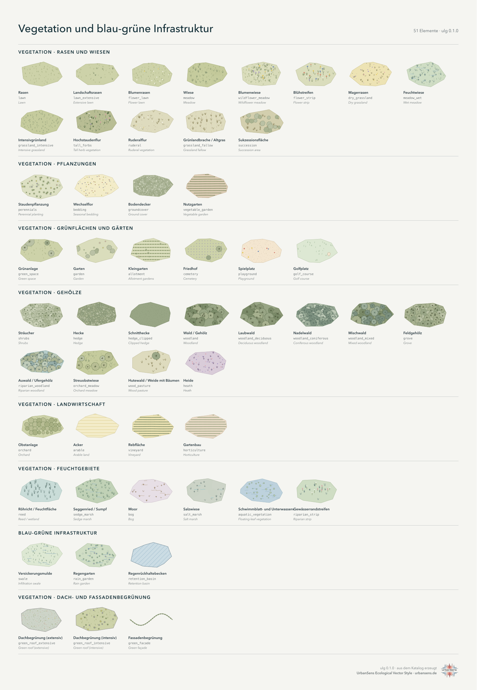
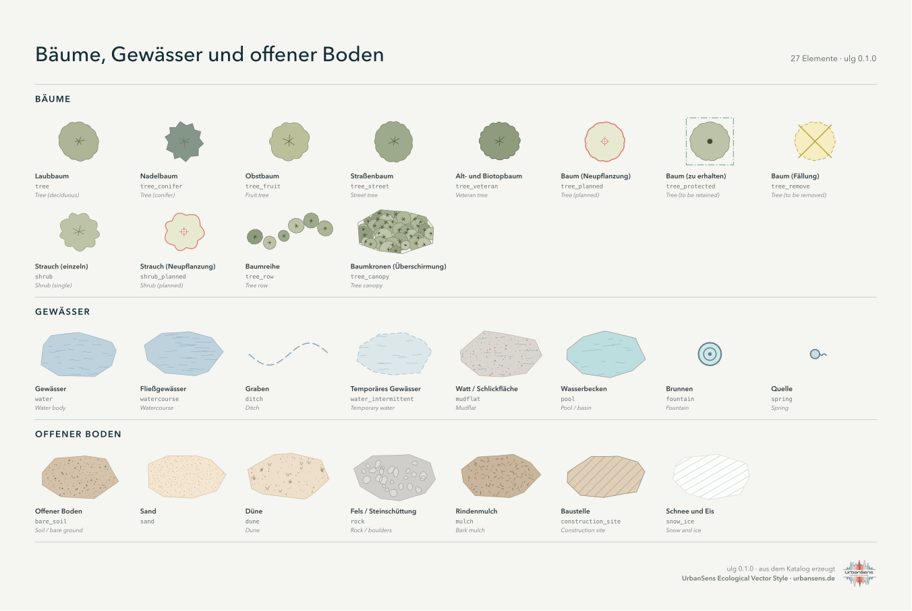
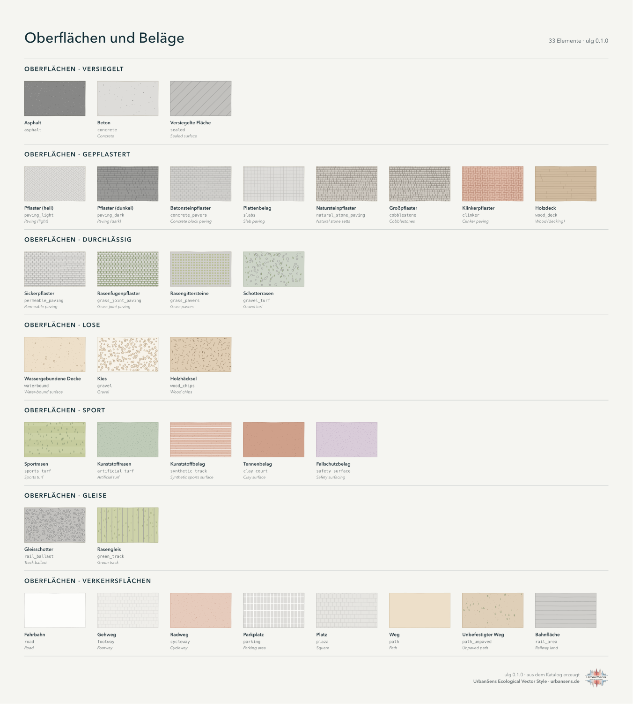
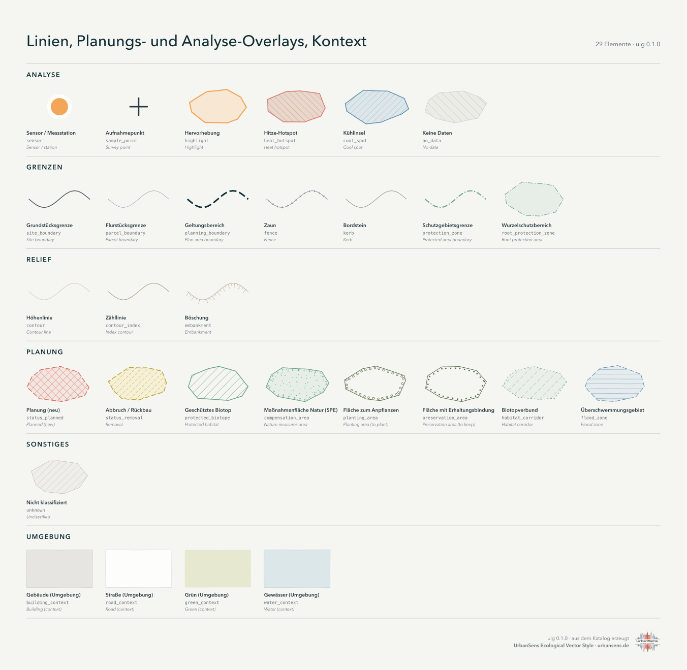

# 3 · Der Katalog

*173 Elemente: alles, was die Karte einer urbanen Landschaft zeigen muss, jeweils mit Aussehen, Namen,
Schlüsseln in anderen Klassifikationen und Standardkennwerten.*

Ein **Element** ist eine Art von Dingen, die auf einer Karte vorkommen können: eine Blumenwiese,
Schotterrasen, ein Straßenbaum, eine Stützmauer, ein Baum (Neupflanzung), ein Hitze-Hotspot. Jede Karte,
jedes Blatt, jede Legende und jeder Export der Bibliothek wird aus diesen Elementen erzeugt, und jede
externe Klassifikation wird *in* sie übersetzt.

## 3.1 Was der Katalog enthält

| Gruppe | Elemente | Beispiele |
|---|---|---|
| `vegetation.*` | 48 | Rasen und Wiesen, Pflanzungen, Grünanlagen und Gärten, Wälder und Hecken, Felder, Feuchtgebiete, Dachbegrünungen |
| `blue_green` | 3 | Versickerungsmulde, Regengarten, Regenrückhaltebecken |
| `trees` | 12 | Laub-, Nadel-, Obst- und Straßenbäume, Alt- und Biotopbäume; geplante, zu erhaltende und zu fällende Bäume; Sträucher; Baumreihen; Baumkronen |
| `water` | 8 | Gewässer, Fließgewässer, Graben, temporäres Gewässer, Wasserbecken, Watt / Schlickfläche, Brunnen, Quelle |
| `ground` | 7 | offener Boden, Sand, Düne, Fels / Steinschüttung, Rindenmulch, Schnee und Eis, Baustelle |
| `surface.*` | 33 | versiegelte, gepflasterte, durchlässige und lose Beläge, Sport- und Gleisflächen; Fahrbahnen, Gehwege, Radwege, Plätze, Parkplätze |
| `landuse` | 10 | Wohnbaufläche, gemischte Baufläche, Gewerbe- und Industriefläche, Gemeinbedarfsfläche, Sportanlage, Freizeit- und Erholungsfläche, Abbaufläche, Deponie / Halde, Flughafen / Flugplatz, Hafengebiet |
| `built` | 11 | Gebäude (Bestand, Nebengebäude, geplant), Gewächshaus, Photovoltaik, Unterbauung, Treppe, Brücke, Mauern |
| `furniture`, `ecology` | 12 | Bank, Abfallbehälter, Leuchte, Fahrradständer, Schild / Infotafel, Spielgerät, Kunstobjekt, Pflanzkübel, Poller; Totholz, Steinhaufen, Nisthilfe |
| `boundary`, `relief` | 10 | Grundstücksgrenze, Flurstücksgrenze, Geltungsbereich, Zaun, Bordstein, Schutzgebietsgrenze, Wurzelschutzbereich; Höhenlinien, Böschung |
| `planning`, `analysis` | 14 | Planungsstatus (neu, Abbruch / Rückbau), geschütztes Biotop, Maßnahmenfläche Natur (SPE), Fläche zum Anpflanzen, Fläche mit Erhaltungsbindung, Biotopverbund, Überschwemmungsgebiet; Sensor / Messstation, Aufnahmepunkt, Hervorhebung, Hitze-Hotspot, Kühlinsel, keine Daten |
| `context`, `other` | 5 | grauer Kontext für die Umgebung; `unknown` für nicht klassifizierte Objekte |

Die vollständige Liste mit Element-IDs, englischen und deutschen Namen und Aliasen steht in
[reference/element-list.md](reference/element-list.md); jedes Element ist auf den folgenden Katalogseiten
gezeichnet.

## 3.2 Die Seiten










Alle Seiten zusammen: [img/catalog-sheet-de.svg](img/catalog-sheet-de.svg) (Vektor, in Originalgröße).
Neu erzeugen lassen sich die Seiten mit `ulg sheet --catalog -o catalog.svg` oder `python tools/build_docs.py sheets`.

## 3.3 Aufbau eines Elements

Die Elemente liegen in `src/ulg/data/elements/*.json`, eine Datei je thematischer Gruppe, mit der
Element-ID als Schlüssel:

```json
"meadow": {
  "group": "vegetation.grass",
  "geometry": ["polygon"],
  "z": 20,
  "label":       {"en": "Meadow", "de": "Wiese"},
  "description": {"en": "Taller, more diverse grass, mown once or twice a year. Medium biodiversity.",
                  "de": "Höherer, vielfältigerer Bewuchs, ein- bis zweischürig. Mittlere Biodiversität."},
  "fill": "grass.400",
  "wash": true,
  "textures": [{"motif": "grass_tufts", "ink": "grass.700", "ink2": "grass.600"}],
  "attributes": {"sealing": "unsealed", "vegetated": true, "biodiversity": 3, "bdla_class": 1,
                 "bff": 1.0, "bff_1990": 1.0, "runoff_cs": 0.2, "runoff_cm": 0.1,
                 "albedo": 0.18, "emissivity": 0.97, "nrr_urban_green": true, "layer": "ground"},
  "aliases": ["Mähwiese", "Extensivwiese", "Extensivgrünland", "hay meadow", "grassland"]
}
```

| Feld | Bedeutung |
|---|---|
| `group` | wohin das Element gehört; der erste Teil (`vegetation`, `surface` …) ist die Familie |
| `geometry` | `polygon`, `line`, `point`: aus welcher Geometrie sich das Element zeichnen lässt. Reine Flächenelemente wie `road` akzeptieren auch Mittellinien, die als Streifen in der jeweiligen Breite gezeichnet werden |
| `z` | Band in der Zeichenreihenfolge (siehe [Stilleitfaden 2.7](02-style.md#27-zeichenreihenfolge)) |
| `label`, `description` | auf Englisch und Deutsch, für Legenden, Blätter und die Suche |
| `fill`, `outline`, `fill_opacity`, `outline_width`, `outline_dash` | flache Darstellung, als Palette-Token |
| `textures` | ein oder zwei Texturmotive mit Zeichenfarben und Einstellungen je LOD (Detailstufe) |
| `line` | für Linienelemente: Farbe, Breite, Strichelung, Umrandung, Zeichen entlang der Linie (Striche, Kreuze, Punkte, Kronen, Böschungsschraffen) |
| `symbol` | für Punkte: `crown` (maßstäblich gezeichnet), `dot` oder ein Piktogramm (`bench`, `lamp`, `planter` …) |
| `border` | Zeichen entlang einer Polygonkante (PlanZV-Grenzen: T-Striche, offene Kreise, gefüllte Punkte) |
| `attributes` | Standardkennwerte und Flags, jeweils mit ihrer Quelle dokumentiert |
| `aliases` | weitere Namen auf Deutsch und Englisch, die von der Suche und von Agenten verwendet werden |

In Python:

```python
el = ulg.element("gravel_turf")
el.name("de")          # 'Schotterrasen'
el.fill                # Hex-Farbwert, aus dem Palette-Token aufgelöst
el.attributes          # {'sealing': 'partly', 'bdla_class': 3, 'bff': 0.4, 'bff_1990': 0.5, 'runoff_cs': 0.3, 'runoff_cm': 0.2, ...}
ulg.codes_for("wildflower_meadow")   # die Klassen anderer Schemata, die darauf abgebildet werden
```

## 3.4 Attribute: Kennwerte, die den Stil begleiten

Dieselbe Element-ID, die eine Farbe wählt, trägt auch die Zahlen, die Planende brauchen. Die Werte werden
aus den genannten Quellen übernommen und **nie interpoliert**: Eine Fläche ohne veröffentlichten Wert hat
keinen, und `ulg.indicators()` meldet, für welchen Anteil des Standorts ein Wert vorlag (Abdeckung), statt
zu raten.

| Attribut | Bedeutung | Quelle |
|---|---|---|
| `sealing` | versiegelt / teilversiegelt / unversiegelt / bebaut | Umweltbundesamt |
| `bdla_class` | fünf Flächenklassen des qualifizierten Freiflächengestaltungsplans | bdla (2022) |
| `bff`, `bff_1990` | Gewichte des Berliner Biotopflächenfaktors (BFF), aktuelle Liste und Liste von 1990 | SenUVK Berlin (2021), BFF-Gutachten (1990) |
| `runoff_cm`, `runoff_cs` | mittlerer Abflussbeiwert und Spitzenabflussbeiwert | DIN 1986-100:2016-12, Tabelle 9 (über eine kommunale Wiedergabe) |
| `albedo`, `emissivity` | Strahlungseigenschaften für Mikroklimamodelle | Tabellen des Modellsystems PALM 6.0 |
| `belagsklasse` | Berliner Belagsklassen nach Wirkung | Umweltatlas Berlin 01.02 |
| `nrr_urban_green` | zählt nach der EU-Verordnung zur Wiederherstellung der Natur (Nature Restoration Regulation, NRR) als urbanes Grün | Verordnung (EU) 2024/1991, Art. 3 Nr. 20, und die darin genannten Copernicus-Daten |
| `canopy`, `layer`, `is_complex`, `vegetated`, `water` | Flags für die Kennzahlen und die Zeichenreihenfolge | Hauskonvention |
| `biodiversity` | grobe Heuristik von 1–5 für schnelle Karten und die Legendenreihenfolge, keine Bewertung | Hauskonvention |

Vollständige Tabelle je Element: [reference/attributes.md](reference/attributes.md).

**Layer.** Elemente mit `layer: ground` teilen den Standort unter sich auf (Landbedeckung). Elemente mit
`layer: roof` (Dachbegrünungen, Photovoltaik) liegen auf Gebäuden und ersetzen bei Abfluss und Albedo die
Gebäudeoberfläche; zusätzlich wird ihre BFF-Gutschrift angerechnet. Elemente mit `layer: overlay` (Grenzen,
Planungs- und Analyse-Overlays, Baumkronen) werden über allem gezeichnet und nie als Fläche gezählt.

**Komplexe.** Elemente mit `is_complex` (Wohnbaufläche, Grünanlage, Friedhof, Kleingarten, Flughafen /
Flugplatz …) stehen für ein ganzes Gelände samt seinen inneren Flächen. Kartieren Sie entweder den Komplex
oder seine Teile; kartieren Sie beides, werden die Teile darüber gezeichnet, und `ulg.flatten()` weist jeden
Quadratmeter dem Teil zu.

## 3.5 Das passende Element finden

```python
ulg.find("Schotterrasen")      # [gravel_turf, lawn, gravel, wood_deck]
ulg.find("Rasengitter")        # [grass_pavers, grass_joint_paving]
ulg.resolve("osm", highway="footway", surface="compacted")    # 'waterbound'
```

```bash
ulg find Blumenwiese
```

```bash
ulg show wildflower_meadow --json
```

```bash
ulg list --group surface
```

Die Suche durchsucht IDs, englische und deutsche Namen und alle Aliase. Passt nichts, sollte das Objekt zu
`unknown` werden (als neutrale Schraffur gezeichnet), bis ein Element hinzugefügt ist, siehe
[Erweitern des Stils](08-extending.md).

---

Weiter: [4 · Python](04-python.md)
