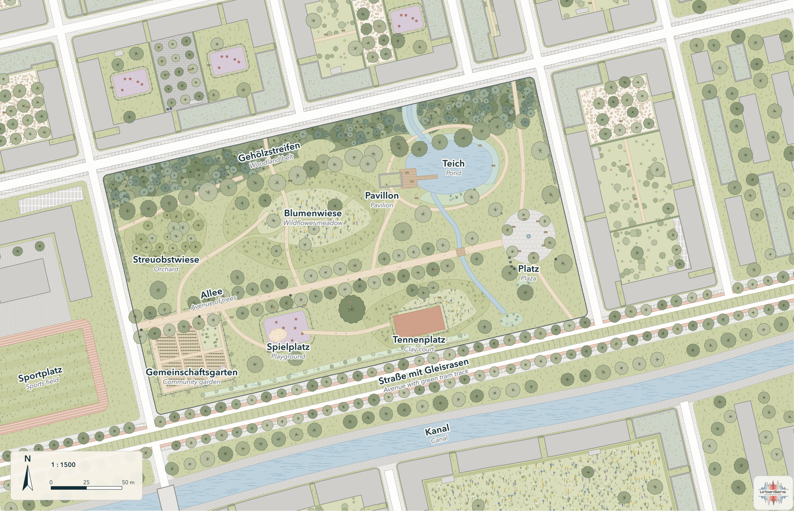
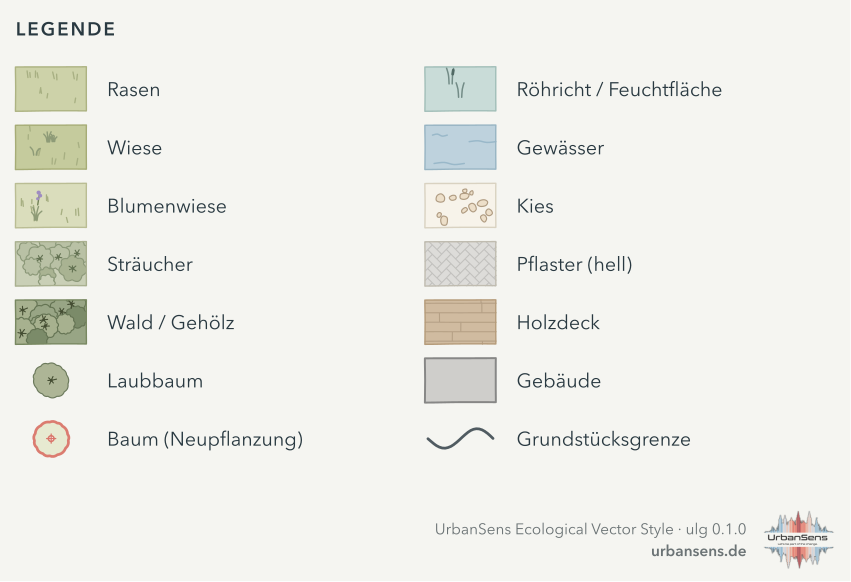
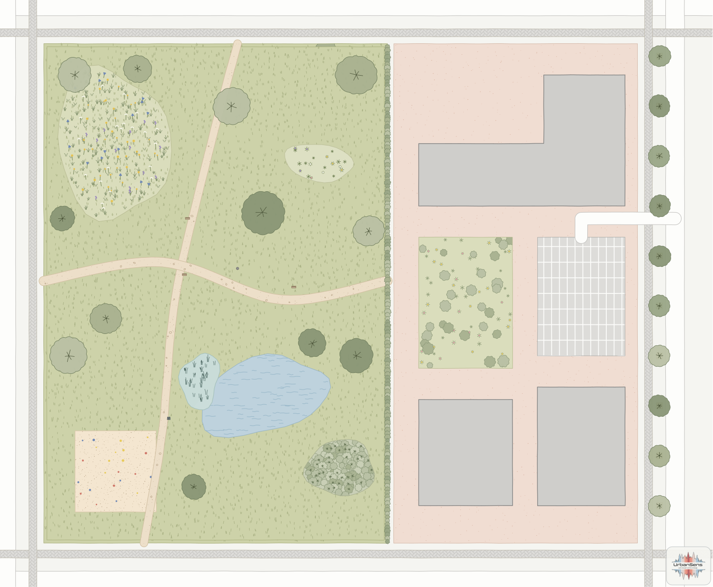
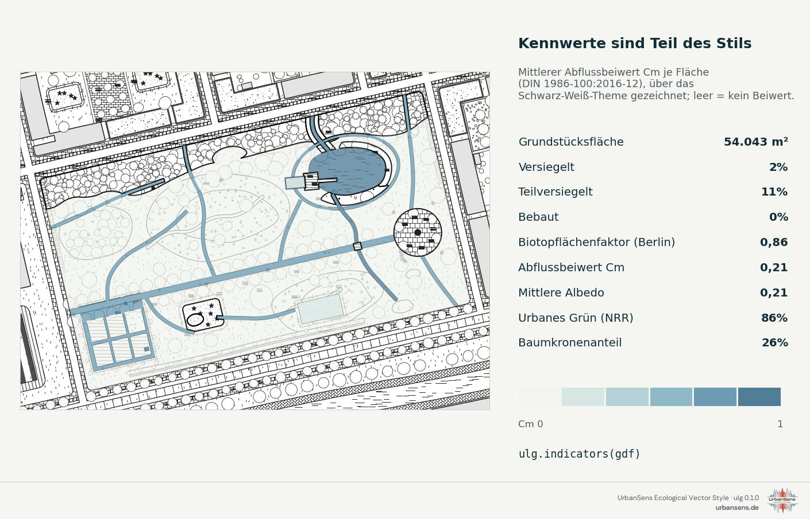

# 4 · Python

*Installieren, nachschlagen, Daten klassifizieren, Karten, Legenden und Blätter zeichnen, Standortkennzahlen berechnen.*

## 4.1 Installation

```bash
pip install -e ".[all]"
```

Python 3.10 oder neuer. Der Kern braucht nur NumPy und Shapely; `geopandas` (GIS-Dateien lesen,
Kennzahlen für DataFrames) und `matplotlib` (Plots, MapLibre-Sprite) sind im Extra `all` enthalten.
Die PNG-Ausgabe nutzt den ersten SVG-Rasterisierer, den sie findet: `rsvg-convert`, CairoSVG oder Inkscape.

Prüfen Sie die Installation:

```bash
ulg --version
```

```bash
ulg check
```

`ulg check` gibt den Lesbarkeitsbericht des Katalogs aus und endet mit `OK`.

## 4.2 Der Stil als Daten

```python
import ulg

lawn = ulg.element("lawn")
lawn.name("de"), lawn.fill              # ('Rasen', '#CDD2A9')

[el.id for el in ulg.find("Schotterrasen")]   # ['gravel_turf', 'lawn', 'gravel', 'wood_deck']
ulg.color("water.300")                  # '#BED2DD', ein Token der Palette
ulg.color("lawn")                       # '#CDD2A9', die Füllung eines Elements
ulg.fills("polygon")                    # {'lawn': '#CDD2A9', 'meadow': '#C5CB9D', ...}
ulg.ramp("heat", 5)                     # ['#F7F1DC', '#F6D5A5', '#EFAC77', '#DB805F', '#B5574F']
ulg.categories("klimatop")              # Klimatopklassen mit Bezeichnungen und Farben
ulg.themes()                            # {'mellow': 'UrbanSens mellow (house style)', 'alkis': ..., ...}
```

Schon `ulg.fills()` allein genügt, um eine Karte in jedem Werkzeug zu gestalten:

```python
gdf.plot(color=gdf.element.map(ulg.fills()))
```

## 4.3 Ihre Daten

Alles, was zeichnet oder misst, akzeptiert:

- ein **GeoDataFrame** mit einer Spalte von Element-IDs (standardmäßig `by="element"`),
- eine **GeoJSON-FeatureCollection** (dict) mit der ID in den Eigenschaften,
- eine Liste von Tupeln `(geometry, element_id)` oder `(geometry, element_id, properties)`.

Verwenden Sie ein **projiziertes Koordinatenbezugssystem (CRS) in Metern** (EPSG:25832 für Bayern). Geografische
GeoDataFrames werden automatisch nach UTM umprojiziert; Texturen, Breiten und Flächen brauchen Meter.

Nützliche Attribute werden gelesen, sofern vorhanden: `crown_diameter` (auch `diameter_crown`,
`kronendurchmesser` …) bestimmt die Größe der Baumkronen, `stammumfang` (cm) oder `stem_diameter` (m) zeichnet
Stämme maßstäblich, und `width`, `lanes` oder die OSM-Klasse `highway` legen die Breite von Straßen und Wegen
fest, die als Mittellinien vorliegen.

Wenn Ihre Daten eine andere Klassifikation verwenden, übersetzen Sie diese (4.5). Bei eigenen Schlüsseln
übergeben Sie ein `mapping`:

```python
ulg.render_svg(gdf, by="nutzung", mapping={"Rasen": "lawn", "Weg": "waterbound", "Teich": "water"})
```

## 4.4 Zeichnen

### SVG, maßstabsgetreu

```python
from ulg.datasets import demo_park_gdf

gdf = demo_park_gdf()                                  # Angerpark, das Demoquartier, EPSG:25832
svg = ulg.render_svg(gdf, scale=1500, path="park.svg") # 1:1500, in Papiermillimetern
svg.lod                                                # 2, die aus dem Maßstab gewählte Detailstufe
```



Wichtige Optionen:

| Argument | Wirkung |
|---|---|
| `scale=500` / `width=180` | Kartenmaßstab oder Seitenbreite in mm (der Maßstab ergibt sich daraus) |
| `extent=(minx, miny, maxx, maxy)` | der zu zeichnende Ausschnitt, in Datenkoordinaten |
| `theme="planzv"` | in einer anderen Konvention zeichnen (`ulg.themes()`) |
| `lod=3` | eine Detailstufe erzwingen (normalerweise aus dem Maßstab gewählt) |
| `handdrawn=0` | exakte Linien; `1` Hausstil; bis `2` skizzenhaft. Amtliche Themes haben standardmäßig 0 |
| `seed=7` | eine andere, ebenso gültige Anordnung der Zeichen (für einen Seed deterministisch) |
| `background=None` | transparente Seite (Standard: das Papier des Themes) |
| `options=ulg.Options(textures=False, outline_width=0.25, ...)` | Feinsteuerung, siehe `help(ulg.Options)` |

PNG und PDF: `ulg.render.rasterize("park.svg", "park.png", dpi=200)`, oder Sie wandeln das SVG mit Inkscape
um (`inkscape park.svg --export-type=pdf`). Das SVG öffnet sich in Inkscape, Illustrator und Affinity
maßgetreu, und jede Objektgruppe trägt ihre Element-ID als `data-element`.

### Matplotlib

```python
ax = ulg.plot(gdf, scale=3000)            # eine neue Abbildung, so bemessen, dass 1 Papiermillimeter 1 mm entspricht
ax.figure.savefig("park.png", dpi=150)

import matplotlib.pyplot as plt
fig, ax = plt.subplots(figsize=(8, 6))
ulg.plot(gdf, ax=ax)                      # in ein vorhandenes Axes-Objekt; es bestimmt den Maßstab
other_layer.plot(ax=ax, zorder=10)        # danach eigene Layer darüber zeichnen
```

### Legenden

```python
from ulg.legend import used_elements

ids = used_elements(zip(gdf.geometry, gdf.element))           # die Elemente der Karte, in Zeichenreihenfolge
ulg.legend_svg(ids, lang="de", title="Legende", columns=2).save("legend.svg")

ax.legend(handles=ulg.legend_handles(["lawn", "meadow", "water"], lang="de"))   # einfache Matplotlib-Legende, nur Farben
```



### Stilblätter

```python
ulg.style_sheet("style.svg")                       # die einseitige Übersicht (Kapitel 2)
ulg.style_sheet("style-de.svg", lang="de")
ulg.catalog_sheet("catalog.svg")                   # jedes Element
ulg.catalog_sheet("trees.svg", groups=["trees"], title="Trees")
ulg.style_sheet("plain.svg", credit=False)         # ohne das kleine UrbanSens-Zeichen in der Ecke
```

Die Blätter tragen dieses Zeichen standardmäßig; `ulg.legend_svg(..., credit=True)` fügt es einer Legende hinzu,
und Ihre eigenen Karten erhalten nie eines. `ulg.credit_line()` liefert die Nennungszeile für eine Bildunterschrift
oder ein Quellenverzeichnis (`'Style: UrbanSens Ecological Vector Style (ulg 0.1.0) · urbansens.de'`, auf Deutsch
mit `lang="de"`). Mehr unter [Lizenz und Nennung](licence-and-credit.md).

## 4.5 Externe Daten klassifizieren

Eine Zuordnungstabelle (Crosswalk) übersetzt die Klassen eines anderen Schemas (OSM-Tags, ALKIS-Objektarten,
XPlanung, BKompV/BayKompV-Biotopschlüssel, CORINE, Urban Atlas und 20 weitere) in Element-IDs.

```python
ulg.resolve("osm", landuse="grass")                       # 'lawn'
ulg.resolve("osm", highway="footway", surface="compacted") # 'waterbound'
ulg.resolve("alkis", objart="41008", funktion="4420")     # 'green_space'
ulg.resolve("clc", "141")                                 # 'green_space'
ulg.explain("clc", "141")
# {'code': '141', 'name': 'Green urban areas', 'element': 'green_space', 'fit': 'exact',
#  'color': '#FFA6FF', 'evidence': 'V', 'level': 3, 'maes': 'Urban', 'note': 'Pink in the official legend, not green.'}

gdf["element"] = ulg.classify(gdf, "osm")        # jede Spalte jeder Zeile fließt in den Abgleich ein
gdf["element"] = ulg.classify(gdf, "clc", column="code_18")   # oder eine einzelne Schlüsselspalte
ulg.official_colors("clc")["141"]                 # '#FFA6FF', die eigene Legendenfarbe des Schemas
ulg.codes_for("wildflower_meadow")                # die Umkehrung: welche Klassen einem Element zugeordnet sind
```

Diese Regeln sollten Sie kennen:

- Der **spezifischste** Eintrag setzt sich durch (`natural=wetland + wetland=reedbed` hat Vorrang vor `natural=wetland`).
- Spaltennamen werden über Aliase abgeglichen (`Objektart`, `OBJART` und `objart` funktionieren alle).
- Hierarchische Schlüssel fallen auf ihre Gruppe zurück (`EUNIS E2.64` → `E2.6` → `E2`).
- Nicht zugeordnete Zeilen werden zu `unknown` und als neutrale Schraffur gezeichnet, damit Lücken sichtbar
  bleiben. Mit `default=None` erhalten Sie stattdessen `None`.
- Jeder Eintrag hat einen **Passgrad** (`fit`: `exact`, `narrower`, `broader`, `nearest` oder `none`), an dem Sie
  sehen, wie gut die Übersetzung passt.

Alle Schemata: `ulg.schemes()` oder [reference/crosswalks.md](reference/crosswalks.md).

## 4.6 OpenStreetMap: gestapelte Flächen und Mittellinien

OSM-Daten stapeln Flächen (Park → Gras → Teich) und bilden Straßen und Wege als Linien ab. Der Renderer
behandelt beides: Flächen werden wie in OSM Carto geschichtet (im Band der Landbedeckung liegen die kleineren
oben), und Straßen, Gehwege und Plätze, die als Linien vorliegen, werden als Streifen in ihrer tatsächlichen
Breite gezeichnet.

```python
import geopandas as gpd

osm = gpd.read_file("examples/data/osm_sample.geojson").to_crs(25832)
osm["element"] = ulg.classify(osm, "osm")
ulg.render_svg(osm, scale=1000, path="block.svg")
```



Für Kennzahlen wenden Sie zuerst **flatten** an: `ulg.flatten()` schneidet von jeder Fläche alles ab, was darüber
gezeichnet wird, und wandelt Mittellinien in Flächen um, sodass jeder Quadratmeter nur einmal gezählt wird.

```python
flat = ulg.flatten(osm)          # GeoDataFrame in einem metrischen CRS, keine Überlappungen in der Landbedeckung
ulg.indicators(flat)["sealed_share"]
```

Fahrbahnen werden unabhängig von ihrem `surface`-Tag als `road` gezeichnet; Wege, Plätze und Spielfelder zeigen
ihr Material. Der vollständige Ablauf steht in [`examples/osm_workflow.py`](../examples/osm_workflow.py).

## 4.7 Standortkennzahlen

```python
site = gdf[gdf.layer.isin(["landcover", "trees"])]
figures = ulg.indicators(site)
```

| Schlüssel | Angerpark | Bedeutung |
|---|---|---|
| `plot_area_m2` | 54.043 | Grundstücksfläche (oder `plot_area=` übergeben) |
| `sealed_share`, `partly_share`, `unsealed_share`, `built_share` | 2 %, 11 %, 83 %, 0,3 % | Versiegelung nach den Begriffen des UBA |
| `bff` | 0,86 | Berliner Biotopflächenfaktor: Bodenfaktoren plus Anrechnungen der Dächer, bezogen auf das Grundstück |
| `runoff_cm`, `runoff_cs` | 0,21 und 0,31 | flächengewichtete Abflussbeiwerte (DIN 1986-100) |
| `albedo` | 0,21 | flächengewichtete Albedo (PALM-Tabellen) |
| `nrr_green_share` | 86 % | urbanes Grün im Sinne der Verordnung (EU) 2024/1991 zur Wiederherstellung der Natur (Nature Restoration Regulation, NRR) |
| `canopy_share` | 26 % | Baumkronenanteil in der Draufsicht, aus Kronenflächen und den Kronenkreisen von Bäumen als Punktobjekten |
| `*_coverage` | 0,83 bis 0,98 | Flächenanteil, für den ein Kennwert bekannt war |
| `by_element_m2` | {...} | Fläche je Element |



Kennwerte werden nie geschätzt: Eine Oberfläche ohne veröffentlichten Wert senkt stattdessen den
Abdeckungsgrad. Dachbegrünung und Photovoltaik zählen zusätzlich zu den Gebäuden, die sie bedecken.

**Bäume.** `ulg.root_protection_zone(trees)` liefert Wurzelschutzbereiche nach DIN 18920 (Kronentraufe plus
1,50 m, Säulenformen plus 5,00 m) und den Mindestabstand für Gräben (`min_trench_distance_m`, vierfacher
Stammumfang, mindestens 2,50 m):

```python
zones = ulg.root_protection_zone(trees, columnar_field="saeulenform")
zones.to_file("root_zones.gpkg")
```

## 4.8 Die Kommandozeile

Der Befehl `ulg` (auch `python -m ulg`) leistet dasselbe, ohne dass Sie Code schreiben müssen; mit `--json`
erhalten Sie eine maschinenlesbare Ausgabe, mit `--lang de` deutsche Bezeichnungen.

| Befehl | Zweck |
|---|---|
| `ulg list --group surface` | Elemente auflisten |
| `ulg find Rasengitter` / `ulg show gravel_turf` | suchen / alles zu einem Element |
| `ulg schemes` / `ulg resolve osm landuse=meadow meadow=wildflower` | Crosswalks |
| `ulg themes` / `ulg categories utci` | Themes und Klassenpaletten |
| `ulg render plan.gpkg --layer flaechen --by nutzung --scheme alkis --scale 500 --png` | eine GIS-Datei zeichnen |
| `ulg indicators plan.gpkg --scheme osm` | Standortkennzahlen |
| `ulg sheet -o style.svg --lang de` / `ulg sheet --catalog -o catalog.svg` | Stilblätter |
| `ulg export qgis out/ --lod auto --theme mellow` | Stildateien für andere Werkzeuge ([Kapitel 5](05-gis-and-web.md)) |
| `ulg check` | Lesbarkeitsbericht |
| `ulg agent` / `ulg agent install` | der Leitfaden für Coding-Agenten ([Kapitel 7](07-agents.md)) |

## 4.9 Rezepte

**Ein Lageplan 1:500 aus einem ALKIS-Auszug**

```python
alkis = gpd.read_file("alkis.gpkg", layer="tatsaechliche_nutzung")
alkis["element"] = ulg.classify(alkis, "alkis")
ulg.render_svg(alkis, scale=500, path="lageplan.svg")
```

**Bauleitplan-Optik für einen Entwurf**

```python
ulg.render_svg(plan, scale=1000, theme="planzv", path="entwurf.svg")
```

**Analysefarben über dem Stil**

```python
ax = ulg.plot(site, theme="mono", lod=1)                       # ruhige Basiskarte
cells.plot(ax=ax, zorder=50, alpha=0.8,
           color=[ulg.category_of("utci", v)["color"] for v in cells.utci])
```

**Eine Webkarte mit folium**

```python
import folium
m = folium.Map(location=[48.15, 11.58], zoom_start=17, tiles=None)
folium.GeoJson(gdf.to_crs(4326), style_function=ulg.style_function()).add_to(m)
```

Mehr: [`examples/`](../examples/) · API: [reference/api.md](reference/api.md)

---

Weiter: [5 · GIS und Web](05-gis-and-web.md)
