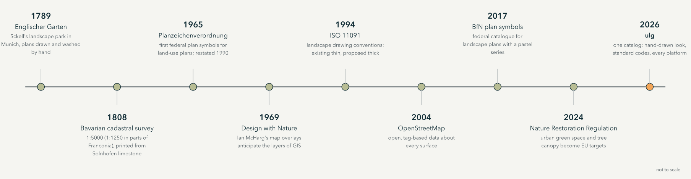
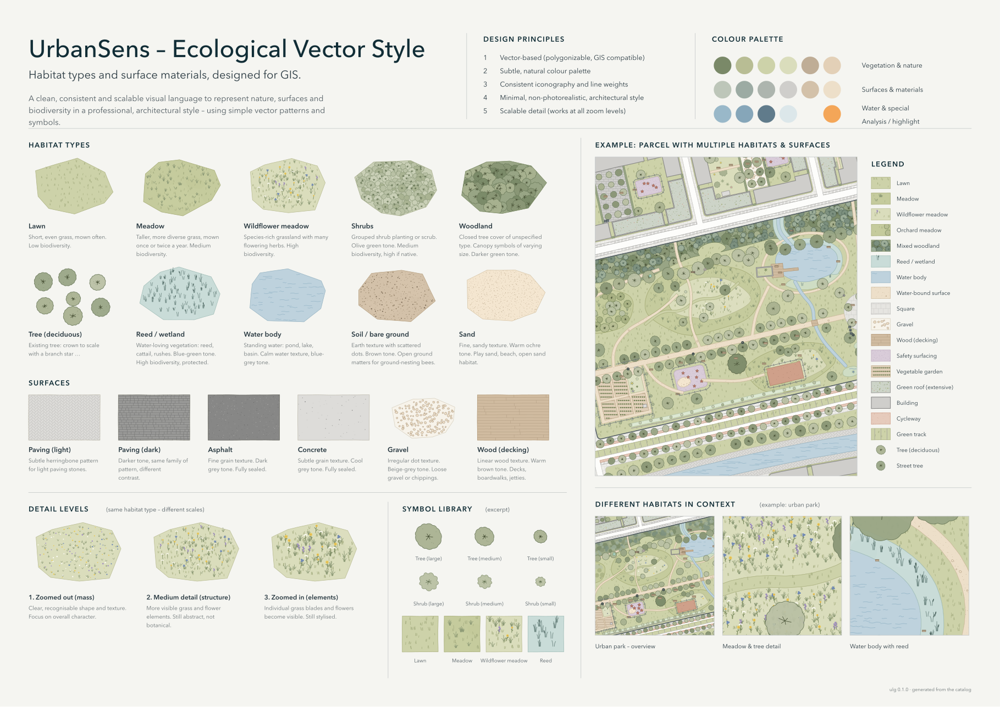
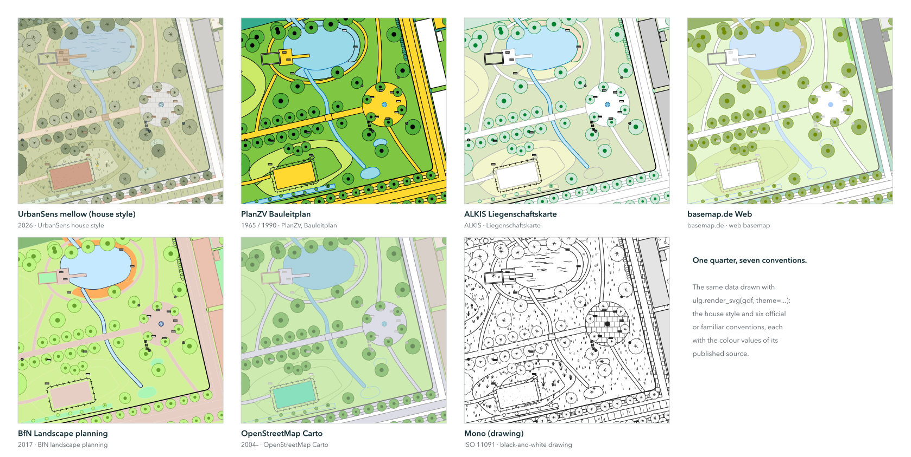

# 1 · Origins

*Where the look of this style comes from: two centuries of washed garden plans, survey sheets and plan
symbols, and why a library is the way to carry them into GIS.*

Landscapes were drawn by hand long before they were mapped by computer. The mellow palette, the small
tufts and crowns and the calm outlines of the UrbanSens style are not an invention; they are a
selection from a tradition that began in the garden plans and survey offices of the early nineteenth
century, several of them in Munich, where UrbanSens works.

---

## 1.1 A park painted in green: Munich, 1789–1806

In August 1789 Elector Karl Theodor decreed a public park along the Isar in Munich, at the initiative
of Benjamin Thompson, later Count Rumford. Friedrich Ludwig von Sckell shaped it as a landscape garden;
it opened in 1792 and, at 3.75 km², is one of the largest city parks in the world: the
**Englischer Garten**. Sckell directed Munich's court gardens from 1804 until his death in 1823.

  

*Detail of the plan of the Englischer Garten, 1806: the Kleinhesseloher See, the village of Schwabing,
meadows and clumps of trees. Königlich bayerische Direction des Topographischen Bureaus. Public domain,
via [Wikimedia Commons](https://commons.wikimedia.org/wiki/File:Kleinhesseloher_See_Plan_1806.jpg).*

Look at the colours of this sheet: pale greens for the meadows, a deeper green for woods, clear blue
for water, brick red for roofs, all on warm paper. Two hundred and twenty years later the UrbanSens
palette uses the same relations: light, low-chroma fills, darker marks of the same hue, saturated
colour only where something needs attention.

*The Monopteros in the Englischer Garten, 26 October 2014. Photo: Julian Herzog,
[CC BY 4.0](https://creativecommons.org/licenses/by/4.0), via
[Wikimedia Commons](https://commons.wikimedia.org/wiki/File:Monopteros_Englischer_Garten_Munich_2014_01.jpg).*

## 1.2 Stone, ink and the survey: the Bavarian Uraufnahme, 1808–1864

In the 1790s Alois Senefelder found that a smooth slab of Solnhofen limestone, drawn on with greasy
ink and wetted, would print: lithography. From 1809 he served as inspector of the royal lithographic
institute in Munich, and the Bavarian survey took up the new technique early.

In 1808 Bavaria began the **Uraufnahme**, the first complete survey of every parcel in the kingdom, for
the land tax. Surveyors worked at 1:5 000, at 1:2 500 for villages and in parts of Franconia even at
1:1 250. More than 23 000 sheets were drawn, engraved on limestone plates and printed; the stones are
still kept by the Bavarian surveying office (LDBV).

*A lithographic stone and the print made from it: an old map of Munich with the Hofgarten and the
Englischer Garten, mirrored on the stone, as printing requires. Photo: Chris 73,
[CC BY-SA 3.0](https://creativecommons.org/licenses/by-sa/3.0), via
[Wikimedia Commons](https://commons.wikimedia.org/wiki/File:Litography_negative_stone_and_positive_paper.jpg).*

The surveyors did not choose their marks freely. The 1808 instruction for the tax survey prescribed
a sign for every kind of ground, and it reads like the first draft of a texture catalog:

  

*"Vorschrift zur Zeichnungsart für die Pläne der Steuer-Rectifications-Vermessung": the drawing rules
of the Bavarian tax survey, after the instruction of 1808. Königlich Bayerisches Vermessungsamt,
c. 1840. Public domain, via
[Wikimedia Commons](https://commons.wikimedia.org/wiki/File:Legende_uraufnahme.pdf).*

Deciduous and coniferous woods, bushes, meadows, mossy meadows, pastures and waste ground, moss, gardens,
vineyards and hop gardens each have their own small mark; buildings, boundaries, paths, rivers and
bridges their own line. Replace *Wiesen* with `meadow`, *Waldungen · Laubholz* with
`woodland_deciduous` and *Gärten* with `garden`, and this page becomes a legend of the catalog in
[chapter 3](03-catalog.md).

## 1.3 Crowns, tufts and washes: the language of garden plans

Landscape architects drew with the same means. In Peter Joseph Lenné's plan for the Berlin Tiergarten
the woods are built out of thousands of small crowns, the open lawns keep the paper tone and the paths
are left white.

*"Verschönerungs-Plan" for the royal Tiergarten in Berlin by Peter Joseph Lenné, drawn by Gerhard
Koeber in quill, pencil and watercolour, 1835. Landesarchiv Berlin. Public domain, via
[Wikimedia Commons](https://commons.wikimedia.org/wiki/File:Tiergarten-Plan_von_Lenn%C3%A9,_1835_-03.jpg).*

Rural maps followed conventions every reader knew. The archive description of this manuscript map
from Württemberg lists them: houses red, fields brown, vineyards with vine symbols, meadows green, woods
as tree symbols, paths brown, the rivers blue ("drawn by eye and freehand").

*Plan of the Enzberg hunting district and Markung, manuscript, undated. Landesarchiv Baden-Württemberg,
Hauptstaatsarchiv Stuttgart N 3 Nr. 47, [CC BY 4.0](https://creativecommons.org/licenses/by/4.0), via
[Wikimedia Commons](https://commons.wikimedia.org/w/index.php?curid=174709525).*

> der nach dem Aug und freier Faust ist gezeichnet worden
>
> Source: end of the title of the Enzberg plan, Landesarchiv Baden-Württemberg, Hauptstaatsarchiv Stuttgart N 3 Nr. 47 (in English: which was drawn by eye and freehand)

Three habits of these drawings became rules of the style: **marks are made by hand but placed with
care** (the wobble never hides the true edge); **texture says what a surface is** (crowns for trees,
tufts for meadow, waves for water); and **colour stays quiet** so that the plan can carry a message.

## 1.4 From colour words to codes: the twentieth century

Planning law turned conventions into rules. The German **Planzeichenverordnung** (PlanZV) first set
federal plan symbols for land-use and zoning plans on 19 January 1965; the current version dates from
18 December 1990 and was last amended on 12 August 2025. It names its colours only in words (*Grün mittel*, *Blau mittel*) and gives one of the most useful rules for vegetation symbols: an
**open** centre marks a tree to be planted, a **filled** centre a tree to be preserved (No. 13.2).

> Die Planzeichen sollen in Farbton, Strichstärke und Dichte den Planunterlagen so angepaßt werden, daß deren Inhalt erkennbar bleibt.
>
> Source: Planzeichenverordnung 1990, § 2 Abs. 3 (in English: the symbols are to be adapted in hue, line weight and density to the base map so that its content stays recognisable)

In 1969 Ian McHarg's *Design with Nature* laid transparent maps of soils, water, slopes and vegetation
on top of one another to find where building would do least harm: the layered map that geographic
information systems made routine. The international standard for landscape drawings,
**ISO 11091** (1994), fixed how plans tell *existing* from *proposed*: thin lines for what is there,
thick lines for what is planned. The cadastre went digital with the **ALKIS** model of the German
surveying authorities, its object types and its signature catalogue.

## 1.5 Open data and ecological targets: the twenty-first century

Since 2004 **OpenStreetMap** has described the surface of the world in open tags (`landuse=meadow`,
`surface=gravel`, `natural=tree`), and its Carto style made them a common visual language. In 2017 the
Federal Agency for Nature Conservation (BfN) published a catalogue of plan symbols for landscape
plans: light tints without outlines for areas of low to moderate value, saturated colours with a black
outline for areas of high value, and brown vertical dashes for fallow. This style adopts that
convention.

In 2024 the EU **Nature Restoration Regulation** (2024/1991) made urban green space and tree canopy a
legal target: no net loss by 2030 compared with 2024, and an increasing trend from 2031, measured with
Copernicus data. What a map shows as green is now also what a city reports.

> By 31 December 2030, Member States shall ensure that there is no net loss in the total national area of urban green space and of urban tree canopy cover in urban ecosystem areas […] compared to 2024.
>
> Source: Regulation (EU) 2024/1991 (Nature Restoration Regulation), Article 8(1)

## 1.6 2026: one catalog

UrbanSens set out the visual language it wanted for its maps on one sheet: habitat types and surface
materials in a clean, mellow, lightly hand-drawn vector style that works at every scale.

> A clean, consistent and scalable visual language to represent nature, surfaces and biodiversity in a professional, architectural style, using simple vector patterns and symbols.
>
> Source: UrbanSens, reference sheet of the Ecological Vector Style

<table>
<tr>
<td width="50%"></td>
<td width="50%"></td>
</tr>
<tr>
<td><em>The brief: the UrbanSens reference sheet for the Ecological Vector Style.</em></td>
<td><em>The result: the same sheet, generated by <code>ulg sheet</code> from the catalog.</em></td>
</tr>
</table>

`ulg` turns that sheet into a library. It keeps the look (quiet colours, textures that say what a
surface is, trees drawn to scale) and ties every element to the conventions this chapter traced:
the codes of ALKIS, XPlanung, the biotope lists and OpenStreetMap, the status symbols of PlanZV and
ISO 11091, the coefficients planners report, and the official colours of each convention when a map
has to follow them.

*One quarter, seven conventions: the demo quarter in the house style and in six official or familiar
conventions, from the same data.*

---

### Image credits

| Image | Author, date | Licence | Source |
|---|---|---|---|
| Plan of the Englischer Garten (detail) | Königlich bayerische Direction des Topographischen Bureaus, 1806 | public domain | [Commons](https://commons.wikimedia.org/wiki/File:Kleinhesseloher_See_Plan_1806.jpg) |
| Monopteros, Englischer Garten | Julian Herzog, 2014 | [CC BY 4.0](https://creativecommons.org/licenses/by/4.0) | [Commons](https://commons.wikimedia.org/wiki/File:Monopteros_Englischer_Garten_Munich_2014_01.jpg) |
| Lithographic stone and print | Chris 73, 2006 | [CC BY-SA 3.0](https://creativecommons.org/licenses/by-sa/3.0) | [Commons](https://commons.wikimedia.org/wiki/File:Litography_negative_stone_and_positive_paper.jpg) |
| Drawing rules of the Bavarian tax survey | Königlich Bayerisches Vermessungsamt, c. 1840 | public domain | [Commons](https://commons.wikimedia.org/wiki/File:Legende_uraufnahme.pdf) |
| Tiergarten plan | Peter Joseph Lenné (design), Gerhard Koeber (drawing), 1835; Landesarchiv Berlin | public domain | [Commons](https://commons.wikimedia.org/wiki/File:Tiergarten-Plan_von_Lenn%C3%A9,_1835_-03.jpg) |
| Plan of the Enzberg hunting district | unknown, undated; Landesarchiv Baden-Württemberg, HStA Stuttgart N 3 Nr. 47 | [CC BY 4.0](https://creativecommons.org/licenses/by/4.0) | [Commons](https://commons.wikimedia.org/w/index.php?curid=174709525) |
| Timeline, reference sheet, style sheet, conventions | UrbanSens / generated with `ulg` | none | this repository |

The historical images are linked from Wikimedia Commons, not copied into the repository; they need an
internet connection to display.

---

Next: [2 · The style guide](02-style.md)
