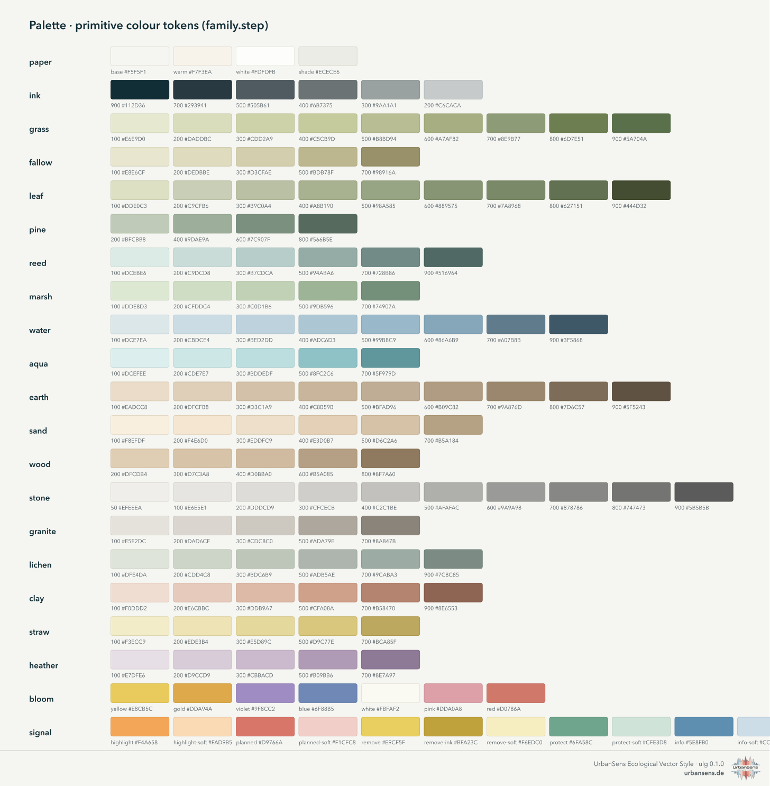
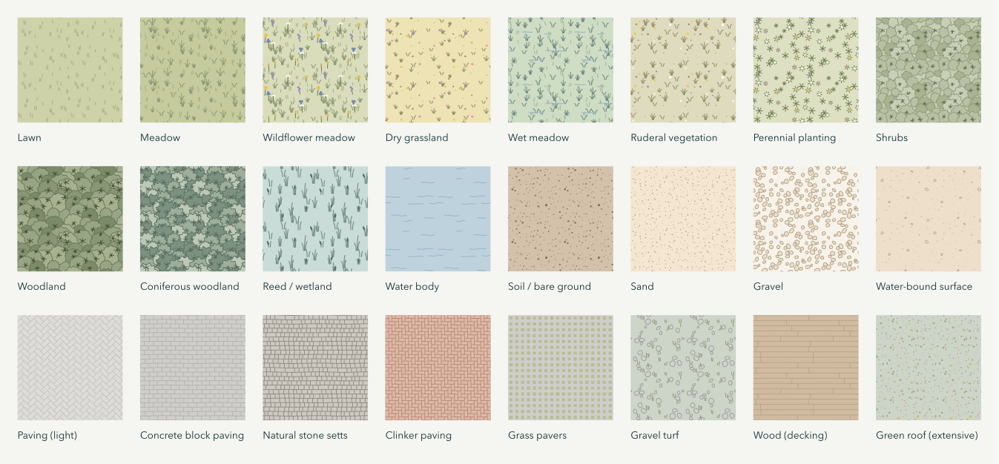
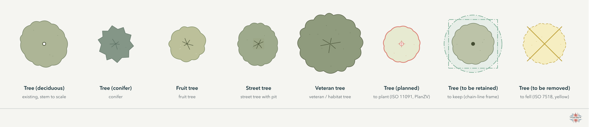
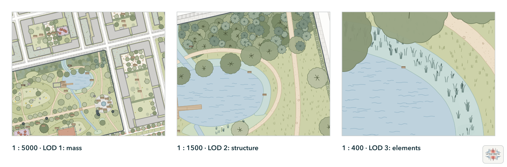
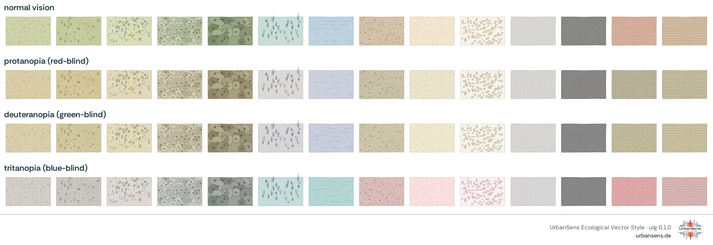
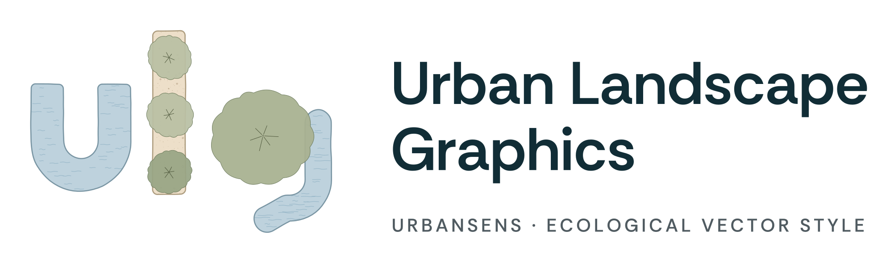
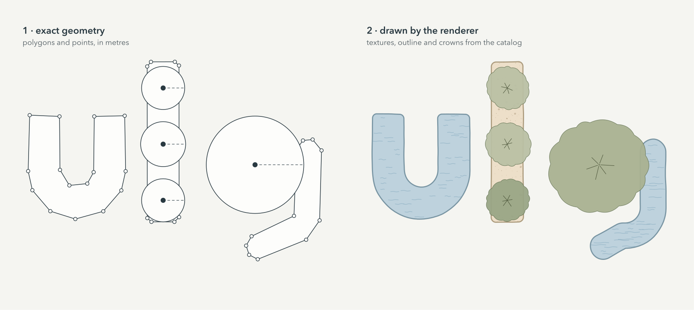

# 2 · The style guide

*The rules of the UrbanSens Ecological Vector Style: what a map in this style looks like, and why.*


The sheet above is not a drawing of the style but a product of it: `ulg sheet` renders it from the same
data that styles your maps, so the guide and the maps cannot drift apart. The German version is
[`img/style-sheet-de.png`](../img/style-sheet-de.png).

---

## 2.1 Five principles

The UrbanSens reference sheet names five design principles. The library turns each of them into something that can be checked:

> Vector-based (polygonizable, GIS compatible) · Subtle, natural color palette · Consistent iconography and line weights · Minimal, non-photorealistic, architectural style · Scalable detail (works at all zoom levels)
>
> Source: UrbanSens, reference sheet of the Ecological Vector Style, "Design principles"

| # | Principle | What it means in practice |
|---|---|---|
| 1 | **Vector-based, GIS-exact** | Every mark is a vector path computed from the feature geometry. Polygons stay the polygons of your data: the hand-drawn wobble moves only the *drawn* outline, and never by more than half the line width (0.09 mm on the standard 0.18 mm outline), so the ink always covers the true edge. |
| 2 | **Subtle, natural palette** | High lightness, low chroma, warm paper. Colours come from named palette tokens (`grass.300`), never from ad-hoc hex values. |
| 3 | **Consistent iconography and line weights** | One line-weight series (ISO 128: 0.13 · 0.18 · 0.25 · 0.35 · 0.5 · 0.7 · 1.0 mm), one outline rule, one symbol grammar for trees and status. |
| 4 | **Minimal, non-photorealistic** | Textures are abstract marks (tufts, ticks, crowns, pebbles, waves) that say *what* a surface is, not what a photo of it looks like. |
| 5 | **Scalable detail** | Four levels of detail follow the map scale. A meadow is a tinted area at 1:20 000, tufts at 1:5 000 and single blades and flowers at 1:500. |

## 2.2 Colour



The palette has 21 families of primitive colours, addressed as `family.step`. Elements, themes and
exporters refer to tokens only; changing a token changes every map, sheet and export at once.

| Family | Role |
|---|---|
| `paper` | page and map background (`paper.base` #F5F5F1), white, shade |
| `ink` | text, outlines, boundaries (`ink.900` #112D36 down to `ink.200`) |
| `grass`, `fallow` | lawns, meadows, pasture, fallow and dry grass |
| `leaf`, `pine` | shrubs and broadleaved crowns; conifers |
| `reed`, `marsh`, `lichen` | reeds and wetlands; wet meadows; grey-greens (salt marsh, permeable surfaces) |
| `water`, `aqua` | natural water; pools, basins and other built water |
| `earth`, `sand`, `wood` | soil, mulch; sand and water-bound surfaces; decks and timber |
| `stone`, `granite`, `clay` | pavings, concrete, buildings; natural stone and commercial land; clinker, clay courts, residential land |
| `straw`, `heather`, `bloom` | fields and bedding; heath and public facilities; flower accents |
| `signal` | planning status and analysis: `highlight` orange, `planned` red, `remove` yellow, `protect` green, `info` blue, each with a `-soft` tint |

**Rules**

- Areas use the light steps (100–400); texture marks use darker steps of the same family (600–900), so
  a texture always reads as part of its surface.
- Outlines are the fill darkened by a fixed amount (`settings.json → outline_darken`), unless an
  element sets its own.
- Saturated colour is reserved for meaning: the `signal` family marks what is planned, removed,
  protected or highlighted. Never use it for land cover.
- Neighbouring land covers must differ by at least ΔE₀₀ 10 in colour, or else in texture or outline
  (checked by `ulg check`, see 2.8).

For analysis layers there are ready ramps and class palettes in the same tonal range:

| Name | Kind | Use |
|---|---|---|
| `heat`, `cool`, `vitality`, `biodiversity`, `sealing` | sequential | thermal load, cooling and shade, vegetation vitality, biodiversity value, degree of sealing |
| `diverging` | diverging | change and anomaly |
| `klimatop` | classes | climatopes with the class names of VDI 3787 Blatt 1 (house colours in the usual hue order) |
| `utci`, `pet` | classes with limits | thermal comfort classes (10 UTCI classes, 9 PET classes) |

```python
ulg.ramp("heat", 5)                  # ['#F7F1DC', '#F6D5A5', '#EFAC77', '#DB805F', '#B5574F']
ulg.category_of("utci", 34.2)        # {'id': 'strong_heat', 'min': 32, 'max': 38, 'color': '#F0B273', ...}
```

## 2.3 Textures



Seventeen texture *motifs* draw every surface. Each element picks one or two motifs and their inks
from the palette:

| Motif | Marks | Used for, for example |
|---|---|---|
| `grass_ticks` | short leaning ticks | lawn, golf course |
| `grass_tufts` | tufts of blades | meadow, heath, bog, salt marsh, dune |
| `flowers` | small heads on stems | wildflower meadow, flower strip, heath |
| `reeds` | upright stems with heads | reed, sedge marsh |
| `canopy` | lobed crowns with a branch star | woodland, grove, orchard meadow, wood pasture |
| `rosettes` | small star plants and dots | perennials, green roofs, recreation areas |
| `rows` | planting rows with plants | vineyard, vegetable garden, allotments, horticulture |
| `waves` | short wave strokes | water, wetland water, mudflat |
| `stipple` | dots of varying size | sand, soil, dune, mudflat, concrete grain |
| `pebbles` | outlined stones | gravel, rock, bunkers, floating leaves |
| `chips` | short splinters | wood chips, bark mulch |
| `bond`, `herringbone`, `cells` | paving joints and grids | concrete pavers, setts, slabs, clinker, grass pavers, solar panels |
| `hatch` | parallel lines, optionally crossed | land use, sports grounds, airports, snow and ice, planning overlays |
| `stripes` | exact bands | mown sports turf, running-track lanes |
| `wash` | faint tonal variation | the watercolour feel of large vegetated areas |

**How textures behave**

- **Anchored to the ground.** Mark positions are derived from ground coordinates, not from the
  feature. Two neighbouring polygons of the same element continue each other's pattern, and a map
  panned or tiled shows the same marks in the same places.
- **Seamless tiles.** For QGIS, SLD and the web the same motifs are drawn into periodic tiles that
  repeat without seams.
- **Clipped to their area.** Crowns and marks never spill over the feature edge, so drawing order
  never changes the look of clean data.
- **Density by level of detail** (2.6), not by feature size, so a texture looks the same on a small
  and a large polygon.

## 2.4 Lines

Line elements use the ISO 128 series from `settings.json → line_weights`: hair 0.13, fine 0.18,
regular 0.25, medium 0.35, bold 0.5, heavy 0.7, extra 1.0 mm. Texture marks are drawn finer than the
finest outline on purpose: they must never compete with a boundary.

| Line | Look | Basis |
|---|---|---|
| Area outline | 0.18 mm, fill darkened, lightly wobbled | house rule |
| Site / parcel boundary | dark continuous / thin grey | plan conventions |
| Plan area boundary | bold dashed dark band | PlanZV 15.13 (black-and-white form) |
| Compensation area | border with T-ticks pointing inwards | PlanZV 13.1 |
| Areas to plant / to preserve | border with open circles / filled dots on the inside | PlanZV 13.2.1 / 13.2.2 |
| Protected area boundary | green chain line | house convention (PlanZV 13.3 uses stroke groups) |
| Root protection zone | green chain line with a light tint | DIN 18920 geometry, ISO 11091 protection line |
| Fence, retaining wall, embankment, contour | small crosses, ticks on the high side, hachures, fine brown lines | topographic conventions |

Lines and roads or paths that arrive as **centre lines** (OpenStreetMap highways) are drawn above
all land cover. Area elements such as roads and footways become strips of their real width (see 2.7).

## 2.5 Symbols



**Trees are drawn to scale.** A crown is a lobed outline of the tree's real diameter (attribute
`crown_diameter`, or the element default), with a branch star from 1:1 500 upwards. When a stem
diameter or girth (`stammumfang` in cm) is known, the stem is drawn to scale too.

**Status follows the standards.** One grammar serves all planning drawings:

| Status | Element | Drawing | Source |
|---|---|---|---|
| existing | `tree` … | thin outline, branch star | ISO 11091 (existing = thin) |
| to plant | `tree_planned`, `shrub_planned` | thick red outline, small cross in an open ring | ISO 11091 (proposed = thick, centre cross); PlanZV 13.2 (open centre = to plant) |
| to keep | `tree_protected` | filled centre, chain-line square frame, root zone | PlanZV 13.2 (filled = to preserve); ISO 11091 protection frame |
| to fell | `tree_remove` | dashed yellow outline with a cross | ISO 11091 removal; Bavarian building-submission colours (grey existing, red new, yellow removal) |

The root protection zone (`ulg.root_protection_zone()`) is the crown drip line plus 1.50 m
(columnar trees plus 5.00 m) after DIN 18920; the minimum distance for trenches is four times the stem
girth, at least 2.50 m.

**Pictograms** mark furniture and ecological structures (bench, bin, lamp, bicycle stand, sign,
play equipment, planter, bollard, deadwood, stone pile, nesting aid …). They are drawn at a fixed paper
size, so they stay legible at every scale, and enlarged automatically in legends and sheets.


## 2.6 Levels of detail



| LOD | Scale | What is drawn |
|---|---|---|
| 3 | 1:750 and larger | single blades, flowers, pebbles, crowns with stems; plan drawings |
| 2 | 1:750 to 1:2 500 | tufts, clusters, crowns with branch stars; site plans and park maps |
| 1 | 1:2 500 to 1:10 000 | fine sparse marks, simplified crowns; district maps |
| 0 | smaller than 1:10 000 | flat colours; city maps and overviews |

`ulg.lod_for_scale(500)` → 3, `ulg.lod_for_zoom(18)` → 2. Give the scale; do not switch textures
off by hand.

## 2.7 Drawing order

Real data is often *stacked*: OpenStreetMap maps a park as one polygon and the lawn, the pond and
the paths inside it as further polygons on top. The style draws in bands so that stacked data looks
right and clean data is unaffected:

| z | Band | Elements |
|---|---|---|
| 1–5 | fallback, context | `unknown`, grey context buildings, roads, green and water |
| 20 | **ground**, drawn largest first | land use and complexes (residential land, parks, cemeteries, playgrounds, airports …), grass, meadows, plantings, woodland, fields, soil, sand, all paved and loose surfaces |
| 30–33 | water, then what lies on water | ponds, rivers, pools; mudflats; reeds, marsh, floating leaves; decks and jetties |
| 35 | lines and centre-line strips | paths, streets, streams and ditches given as lines |
| 50–66 | hedges and built | hedges, bridges, stairs, buildings, green roofs, solar panels, walls |
| 66–76 | trees and points | crowns, furniture, ecology |
| 84–98 | overlays | boundaries, planning, analysis |

Inside the ground band **smaller areas are drawn on top of larger ones**, the rule OpenStreetMap
Carto uses for land cover. A playground inside a park, a lawn covering the park, a meadow inside the
lawn and a clearing inside a wood all stay visible, and a complex such as a park never hides the
surfaces mapped inside it. Water comes above the ground band because ponds are routinely mapped on
top of parks and woods. `ulg.flatten()` applies the same order to the geometry itself, which turns
stacked data into a clean partition for area statistics.

## 2.8 Legibility



`ulg check` (and the test suite) enforces three rules:

1. **Distinguishable.** Two land covers that are closer than ΔE₀₀ 10 must differ in texture or
   outline. Pairs that differ in nothing are errors.
2. **Colour-vision safe.** The same test is repeated after simulating protanopia, deuteranopia and
   tritanopia (Machado et al. 2009). Meaning never depends on hue alone (WCAG 2 success criterion
   1.4.1).
3. **Marks with contrast.** Texture marks are measured against their fill; the report lists the
   weakest, and symbols and boundaries follow WCAG 1.4.11 for non-text contrast.

## 2.9 Typography and layout

Sheets, legends and titles use a humanist sans-serif (Avenir Next, falling back to Nunito Sans,
Source Sans 3, Helvetica Neue, Arial), `ink.900` for titles and `ink.500` for secondary text, small
capitals with wide tracking for section heads, and thin `ink.200` rules. Maps are laid out in paper
millimetres at the chosen scale.

## 2.10 Themes: the same map in other conventions


The house style is `mellow`. Six further themes redraw the same data in an official or familiar
convention, with the colour values of the published source: `planzv` (land-use and zoning plans),
`alkis` (cadastral map), `basemap` (basemap.de), `bfn` (landscape planning), `osm` (OpenStreetMap
Carto) and `mono` (black-and-white drawing after ISO 11091). Official themes use flat colours and
exact lines. Sources and evidence: [Standards](06-standards.md#62-themes) and
[reference/themes.md](../reference/themes.md).

## 2.11 Do and don't

| Do | Don't |
|---|---|
| Look an element up (`ulg.find("Schotterrasen")`) | Invent a colour or texture for a surface that exists in the catalog |
| Classify external data with a crosswalk | Map codes to colours by hand |
| Give the map scale | Switch textures on or off by hand |
| Keep planning status in the status elements | Colour a planned tree green because it will be green |
| Use `signal` colours for meaning only | Use orange or red for land cover |
| Fix `unknown` features at the source | Hide unclassified features |
| Work in a metric CRS (EPSG:25832 in Bavaria) | Measure or texture in degrees |

## 2.12 The mark

The logo spells *ulg* with three things of a landscape plan, each drawn by the library from a catalog
element: a **pond** in the shape of a *u* (`water`), a **tree-lined path** as the *l* (`waterbound` and
`tree`), and a **tree crown with a stream** as the tail of the *g* (`tree` and `watercourse`). The hand-drawn
outline and the texture marks are the renderer's, so the mark is a specimen of the style: exact geometry
underneath, an imperfect drawing on top.





*Left: the geometry in metres, polygons with their vertices and trees as points with a crown radius. Right: the
same data drawn at 1:300 by the renderer that `ulg.render_svg` uses.*

| File in `docs/img/logo/` | Use |
|---|---|
| `ulg-logo.svg`, `.png` | mark, name and tagline side by side; the default |
| `ulg-logo-stacked.svg`, `.png` | the same, centred, for square spaces |
| `ulg-logo-dark.svg`, `.png` | for dark backgrounds (`ink.900`) |
| `ulg-mark.svg`, `ulg-mark-dark.svg` | the mark alone |
| `ulg-mark-small.svg` | the mark without texture marks and with a stronger outline, for sizes below 40 px |
| `ulg-favicon.svg`, `favicon.ico`, `apple-touch-icon.png` | the *g* on a rounded tile: crown and stream stay readable at 16 px |

The name is set in Rethink Sans (SIL Open Font License) and converted to outlines, so the files need no font.
Keep a free margin of half the height of the mark around it, show it at no less than 24 px tall (use
`ulg-mark-small.svg` below 40 px), and do not recolour it: the colours are palette tokens (`water.300`,
`sand.300`, `leaf.300`–`leaf.600`). `python tools/build_logo.py` redraws every file from the catalog, so a change of the palette
changes the logo with it.

**The UrbanSens mark.** The style sheet, the catalog sheets and the figures of this documentation carry the small
UrbanSens logo in a corner, with the website and the version; `credit=False` leaves it out. Details and the credit
request: [Licence and credit](licence-and-credit.md).

---

Next: [3 · The catalog](03-catalog.md)
