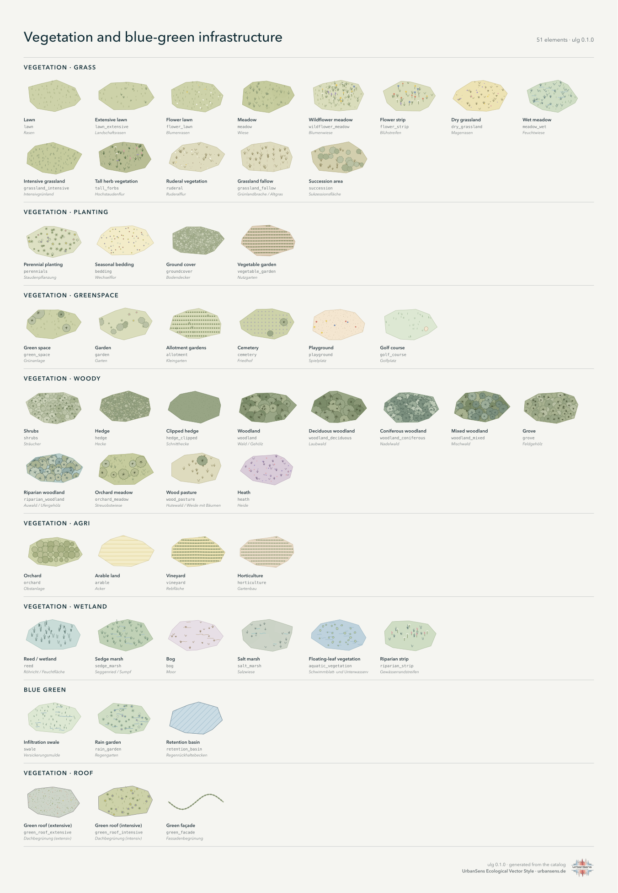
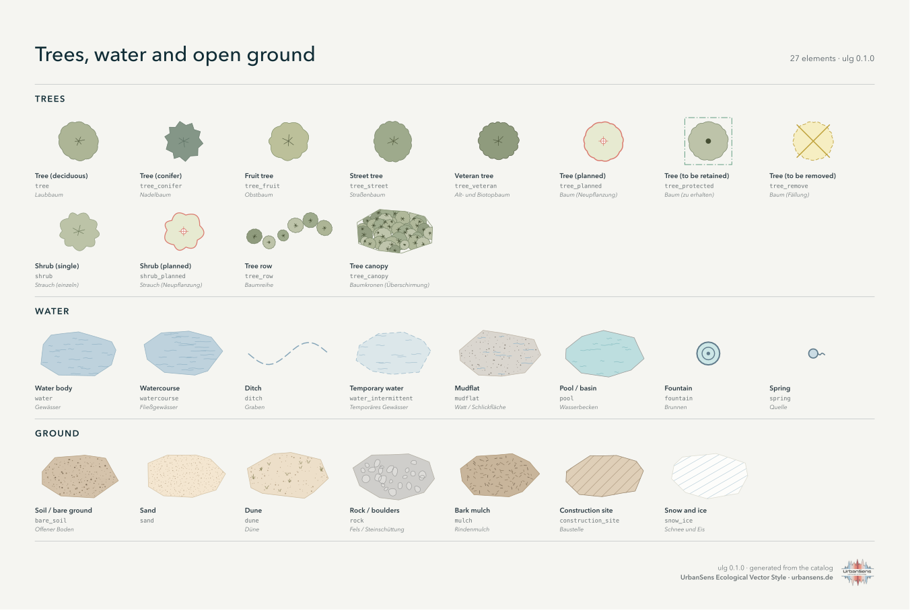
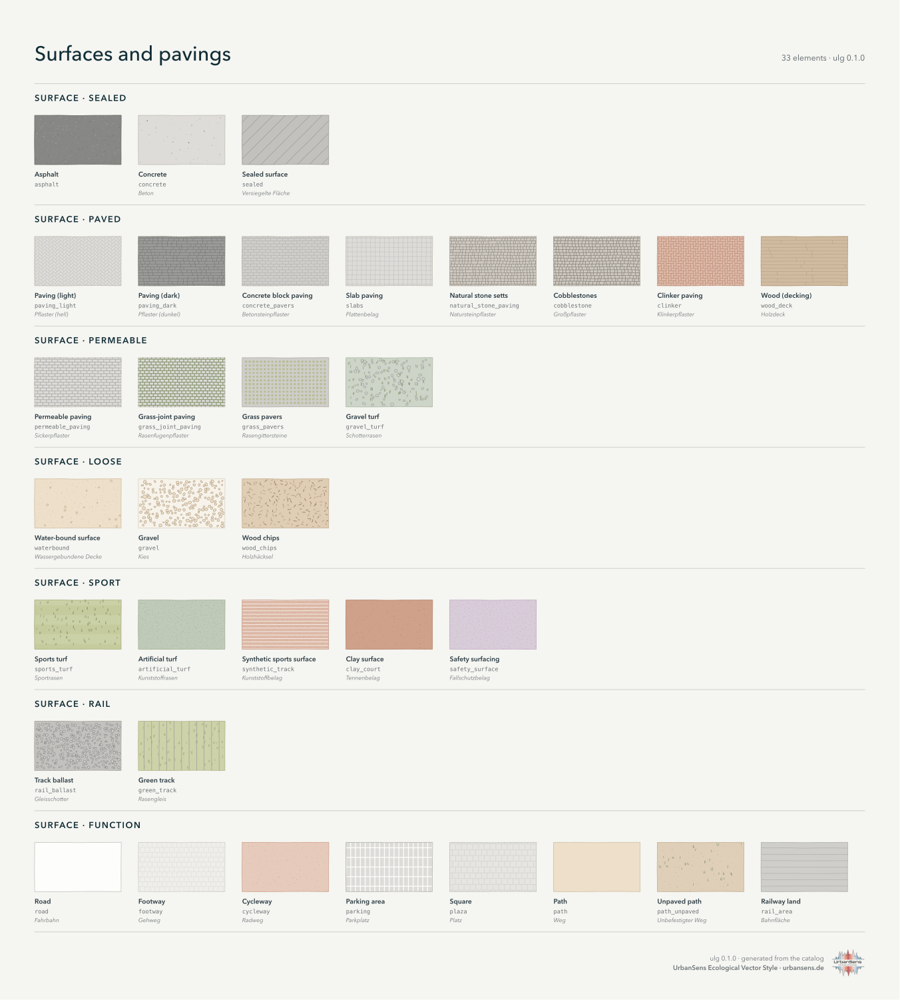
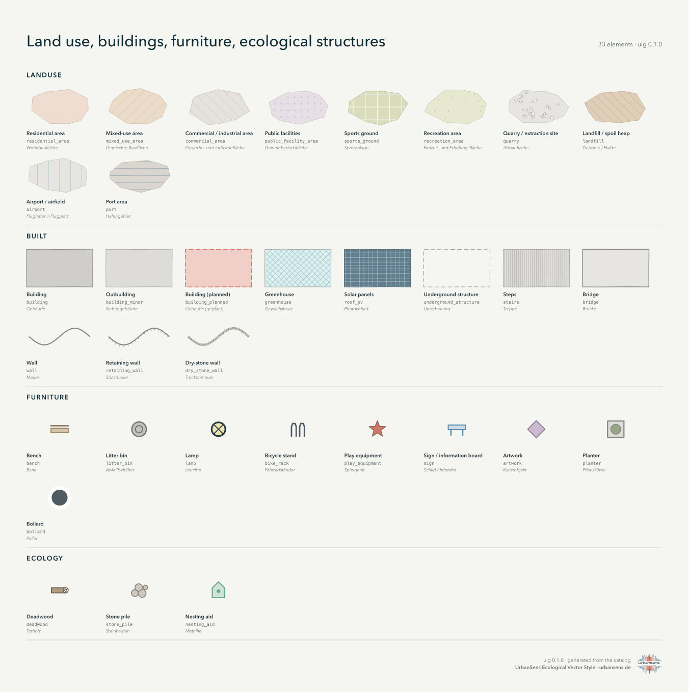
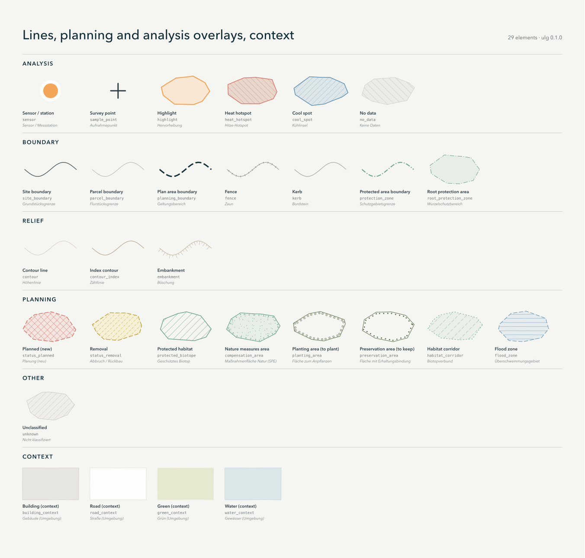

# 3 · The catalog

*173 elements: everything a map of an urban landscape needs to show, each with its look, its names,
its codes in other classifications and its standard coefficients.*

An **element** is one kind of thing you can put on a map: a wildflower meadow, gravel turf, a street
tree, a retaining wall, a planned tree, a heat hotspot. Every map, sheet, legend and export of the
library is drawn from these elements, and every external classification is translated *into* them.

## 3.1 What is in it

| Group | Elements | Examples |
|---|---|---|
| `vegetation.*` | 48 | lawns and meadows, plantings, parks and gardens, woodland and hedges, fields, wetlands, green roofs |
| `blue_green` | 3 | infiltration swale, rain garden, retention basin |
| `trees` | 12 | deciduous, conifer, fruit, street and veteran trees; planned, protected and felled trees; shrubs; tree rows; canopy |
| `water` | 8 | water body, watercourse, ditch, temporary water, pool, mudflat, fountain, spring |
| `ground` | 7 | bare soil, sand, dune, rock, mulch, snow and ice, construction site |
| `surface.*` | 33 | sealed, paved, permeable, loose, sport and rail surfaces; roads, footways, cycleways, squares, parking |
| `landuse` | 10 | residential, mixed, commercial, public, sports, recreation, quarry, landfill, airport, port |
| `built` | 11 | buildings (existing, minor, planned), greenhouse, solar panels, underground structure, steps, bridge, walls |
| `furniture`, `ecology` | 12 | bench, bin, lamp, bicycle stand, sign, play equipment, artwork, planter, bollard; deadwood, stone pile, nesting aid |
| `boundary`, `relief` | 10 | site, parcel and plan-area boundaries, fence, kerb, protection zones; contours, embankment |
| `planning`, `analysis` | 14 | planned/removal status, protected biotope, compensation, planting and preservation areas, habitat corridor, flood zone; sensor, survey point, highlight, heat hotspot, cool spot, no data |
| `context`, `other` | 5 | grey context for surroundings; `unknown` for unclassified features |

The complete list with ids, English and German names and aliases is
[reference/element-list.md](../reference/element-list.md); every element is drawn on the catalog pages below.

## 3.2 The pages











All pages together: [img/catalog-sheet.svg](../img/catalog-sheet.svg) (vector, true to size).
Regenerate with `ulg sheet --catalog -o catalog.svg` or `python tools/build_docs.py sheets`.

## 3.3 Anatomy of an element

Elements live in `src/ulg/data/elements/*.json`, one file per theme group, keyed by id:

```json
"meadow": {
  "group": "vegetation.grass",
  "geometry": ["polygon"],
  "z": 20,
  "label":       {"en": "Meadow", "de": "Wiese"},
  "description": {"en": "Taller, more diverse grass, mown once or twice a year. Medium biodiversity.",
                  "de": "Höherer, vielfältigerer Bewuchs, ein- bis zweischürig. Mittlere Biodiversität."},
  "fill": "grass.400",
  "wash": true,
  "textures": [{"motif": "grass_tufts", "ink": "grass.700", "ink2": "grass.600"}],
  "attributes": {"sealing": "unsealed", "vegetated": true, "biodiversity": 3, "bdla_class": 1,
                 "bff": 1.0, "bff_1990": 1.0, "runoff_cs": 0.2, "runoff_cm": 0.1,
                 "albedo": 0.18, "emissivity": 0.97, "nrr_urban_green": true, "layer": "ground"},
  "aliases": ["Mähwiese", "Extensivwiese", "Extensivgrünland", "hay meadow", "grassland"]
}
```

| Field | Meaning |
|---|---|
| `group` | where the element belongs; the first part (`vegetation`, `surface` …) is the family |
| `geometry` | `polygon`, `line`, `point`: what the element can be drawn from. Area-only elements such as `road` also accept centre lines, drawn as strips of their width |
| `z` | drawing band (see [style guide 2.7](02-style.md#27-drawing-order)) |
| `label`, `description` | English and German, for legends, sheets and search |
| `fill`, `outline`, `fill_opacity`, `outline_width`, `outline_dash` | flat look, as palette tokens |
| `textures` | one or two texture motifs with inks and per-LOD settings |
| `line` | for line elements: colour, width, dash, casing, marks along the line (ticks, crosses, dots, crowns, hachures) |
| `symbol` | for points: `crown` (drawn to scale), `dot`, or a pictogram (`bench`, `lamp`, `planter` …) |
| `border` | marks along a polygon edge (PlanZV borders: tees, open circles, filled dots) |
| `attributes` | standard coefficients and flags, each documented with its source |
| `aliases` | other names in German and English, used by search and by agents |

In Python:

```python
el = ulg.element("gravel_turf")
el.name("de")          # 'Schotterrasen'
el.fill                # hex colour, resolved from the palette token
el.attributes          # {'sealing': 'partly', 'bdla_class': 3, 'bff': 0.4, 'bff_1990': 0.5, 'runoff_cs': 0.3, 'runoff_cm': 0.2, ...}
ulg.codes_for("wildflower_meadow")   # the classes of other schemes that map onto it
```

## 3.4 Attributes: coefficients that travel with the style

The same id that picks a colour also carries the numbers planners need. Values are copied from
the named sources and **never interpolated**: a surface without a published value has none, and
`ulg.indicators()` reports how much of the site had a value (coverage) instead of guessing.

| Attribute | Meaning | Source |
|---|---|---|
| `sealing` | sealed / partly / unsealed / built | Umweltbundesamt |
| `bdla_class` | five surface classes of the qualified open-space plan | bdla (2022) |
| `bff`, `bff_1990` | Berlin biotope area factor weights, current list and 1990 list | SenUVK Berlin (2021), BFF report (1990) |
| `runoff_cm`, `runoff_cs` | mean and peak runoff coefficients | DIN 1986-100:2016-12, Table 9 (via a municipal reproduction) |
| `albedo`, `emissivity` | radiative properties for microclimate models | PALM model system 6.0 tables |
| `belagsklasse` | Berlin paving impact classes | Berlin Umweltatlas 01.02 |
| `nrr_urban_green` | counts as urban green space under the EU Nature Restoration Regulation | Regulation (EU) 2024/1991, Art. 3(20) and the Copernicus data it names |
| `canopy`, `layer`, `is_complex`, `vegetated`, `water` | flags used by the indicators and the drawing order | house |
| `biodiversity` | rough 1–5 heuristic for quick maps and legend order, not a valuation | house |

Full table per element: [reference/attributes.md](../reference/attributes.md).

**Layers.** `layer: ground` elements tile the site (land cover). `layer: roof` elements (green roofs,
solar panels) lie on buildings and replace the building surface in runoff and albedo; they add their
BFF credit on top. `layer: overlay` elements (boundaries, planning and analysis overlays, tree canopy)
are drawn over everything and never counted as area.

**Complexes.** Elements with `is_complex` (residential area, park, cemetery, allotments, airport …)
stand for a whole site with its internal surfaces. Map either the complex or its parts; if you map
both, the parts are drawn on top and `ulg.flatten()` gives each square metre to the part.

## 3.5 Finding the right element

```python
ulg.find("Schotterrasen")      # [gravel_turf, lawn, gravel, wood_deck]
ulg.find("Rasengitter")        # [grass_pavers, grass_joint_paving]
ulg.resolve("osm", highway="footway", surface="compacted")    # 'waterbound'
```

```bash
ulg find Blumenwiese
```

```bash
ulg show wildflower_meadow --json
```

```bash
ulg list --group surface
```

Search looks at ids, English and German names and all aliases. If nothing fits, the feature should
become `unknown` (drawn as a neutral hatch) until an element is added, see
[Extending](08-extending.md).

---

Next: [4 · Python](04-python.md)
