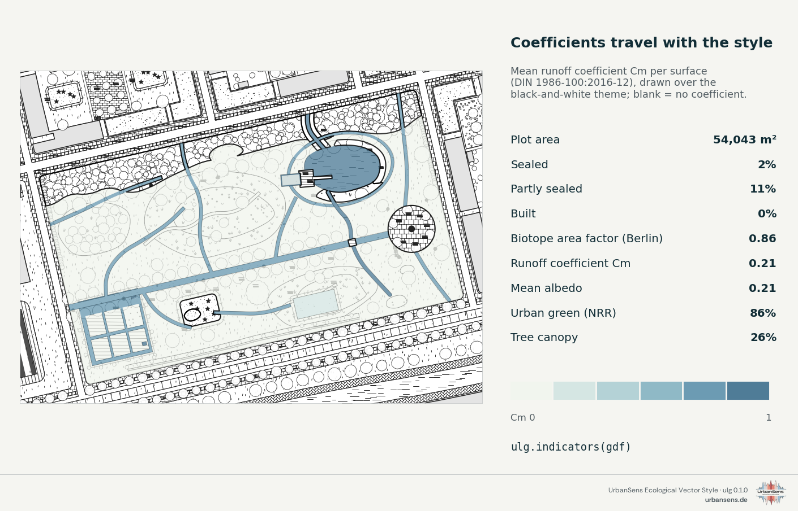

# 4 · Using the library in Python

*Install, look things up, classify your data, draw maps, legends and sheets, compute site figures.*

## 4.1 Install

```bash
pip install -e ".[all]"
```

Python 3.10 or newer. The core needs only NumPy and Shapely; `geopandas` (reading GIS files,
indicators on data frames) and `matplotlib` (plots, the MapLibre sprite) come with the `all` extra.
PNG output uses the first SVG rasteriser it finds: `rsvg-convert`, CairoSVG or Inkscape.

Check the installation:

```bash
ulg --version
```

```bash
ulg check
```

`ulg check` prints the legibility report of the catalog and ends with `OK`.

## 4.2 The style as data

```python
import ulg

lawn = ulg.element("lawn")
lawn.name("de"), lawn.fill              # ('Rasen', '#CDD2A9')

[el.id for el in ulg.find("Schotterrasen")]   # ['gravel_turf', 'lawn', 'gravel', 'wood_deck']
ulg.color("water.300")                  # '#BED2DD', a palette token
ulg.color("lawn")                       # '#CDD2A9', an element's fill
ulg.fills("polygon")                    # {'lawn': '#CDD2A9', 'meadow': '#C5CB9D', ...}
ulg.ramp("heat", 5)                     # ['#F7F1DC', '#F6D5A5', '#EFAC77', '#DB805F', '#B5574F']
ulg.categories("klimatop")              # climatope classes with labels and colours
ulg.themes()                            # {'mellow': 'UrbanSens mellow (house style)', 'alkis': ..., ...}
```

`ulg.fills()` alone already styles a map in any tool:

```python
gdf.plot(color=gdf.element.map(ulg.fills()))
```

## 4.3 Your data

Everything that draws or measures accepts

- a **GeoDataFrame** with a column of element ids (`by="element"` by default),
- a **GeoJSON FeatureCollection** (dict) with the id in the properties,
- a list of `(geometry, element_id)` or `(geometry, element_id, properties)` tuples.

Use a **projected CRS in metres** (EPSG:25832 for Bavaria). Geographic GeoDataFrames are reprojected
to UTM automatically; textures, widths and areas need metres.

Useful attributes are read when present: `crown_diameter` (also `diameter_crown`,
`kronendurchmesser` …) sizes tree crowns, `stammumfang` (cm) or `stem_diameter` (m) draws stems to
scale, and `width`, `lanes` or the OSM `highway` class set the width of roads and paths given as
centre lines.

If your data uses another classification, translate it (4.5). If it uses your own codes, pass a
`mapping`:

```python
ulg.render_svg(gdf, by="nutzung", mapping={"Rasen": "lawn", "Weg": "waterbound", "Teich": "water"})
```

## 4.4 Drawing

### SVG, true to scale

```python
from ulg.datasets import demo_park_gdf

gdf = demo_park_gdf()                                  # Angerpark, the demo quarter, EPSG:25832
svg = ulg.render_svg(gdf, scale=1500, path="park.svg") # 1:1500, in paper millimetres
svg.lod                                                # 2, the level of detail chosen from the scale
```


Options that matter:

| Argument | Effect |
|---|---|
| `scale=500` / `width=180` | map scale, or the page width in mm (the scale follows) |
| `extent=(minx, miny, maxx, maxy)` | the window to draw, in data coordinates |
| `theme="planzv"` | draw in another convention (`ulg.themes()`) |
| `lod=3` | force a level of detail (normally chosen from the scale) |
| `handdrawn=0` | exact lines; `1` house style; up to `2` sketchy. Official themes default to 0 |
| `seed=7` | another, equally valid, arrangement of marks (deterministic for a seed) |
| `background=None` | transparent page (default: the theme's paper) |
| `options=ulg.Options(textures=False, outline_width=0.25, ...)` | fine control, see `help(ulg.Options)` |

PNG and PDF: `ulg.render.rasterize("park.svg", "park.png", dpi=200)`, or convert the SVG with Inkscape
(`inkscape park.svg --export-type=pdf`). The SVG opens true to size in Inkscape, Illustrator and
Affinity, and every feature group carries its element id as `data-element`.

### Matplotlib

```python
ax = ulg.plot(gdf, scale=3000)            # a new figure sized so that 1 paper mm is 1 mm
ax.figure.savefig("park.png", dpi=150)

import matplotlib.pyplot as plt
fig, ax = plt.subplots(figsize=(8, 6))
ulg.plot(gdf, ax=ax)                      # into an existing axes; the axes decide the scale
other_layer.plot(ax=ax, zorder=10)        # then draw your own layers on top
```

### Legends

```python
from ulg.legend import used_elements

ids = used_elements(zip(gdf.geometry, gdf.element))           # the elements on the map, in order
ulg.legend_svg(ids, lang="de", title="Legende", columns=2).save("legend.svg")

ax.legend(handles=ulg.legend_handles(["lawn", "meadow", "water"], lang="de"))   # flat Matplotlib legend
```


### Style sheets

```python
ulg.style_sheet("style.svg")                       # the one-page overview (section 2)
ulg.style_sheet("style-de.svg", lang="de")
ulg.catalog_sheet("catalog.svg")                   # every element
ulg.catalog_sheet("trees.svg", groups=["trees"], title="Trees")
ulg.style_sheet("plain.svg", credit=False)         # without the small UrbanSens mark in the corner
```

The sheets carry that mark by default; `ulg.legend_svg(..., credit=True)` adds it to a legend, and your own maps
never get one. `ulg.credit_line()` returns the line for a caption or a list of sources
(`'Style: UrbanSens Ecological Vector Style (ulg 0.1.0) · urbansens.de'`, German with `lang="de"`). More in
[Licence and credit](licence-and-credit.md).

## 4.5 Classifying external data

A crosswalk translates the classes of another scheme (OSM tags, ALKIS object types, XPlanung,
BKompV/BayKompV biotope codes, CORINE, Urban Atlas and 20 more) into element ids.

```python
ulg.resolve("osm", landuse="grass")                       # 'lawn'
ulg.resolve("osm", highway="footway", surface="compacted") # 'waterbound'
ulg.resolve("alkis", objart="41008", funktion="4420")     # 'green_space'
ulg.resolve("clc", "141")                                 # 'green_space'
ulg.explain("clc", "141")
# {'code': '141', 'name': 'Green urban areas', 'element': 'green_space', 'fit': 'exact',
#  'color': '#FFA6FF', 'evidence': 'V', 'level': 3, 'maes': 'Urban', 'note': 'Pink in the official legend, not green.'}

gdf["element"] = ulg.classify(gdf, "osm")        # every column of every row takes part in matching
gdf["element"] = ulg.classify(gdf, "clc", column="code_18")   # or a single code column
ulg.official_colors("clc")["141"]                 # '#FFA6FF', the scheme's own legend colour
ulg.codes_for("wildflower_meadow")                # the reverse: which classes map onto an element
```

Rules worth knowing:

- The **most specific** entry wins (`natural=wetland + wetland=reedbed` beats `natural=wetland`).
- Column names are matched through aliases (`Objektart`, `OBJART`, `objart` all work).
- Hierarchical codes fall back to their group (`EUNIS E2.64` → `E2.6` → `E2`).
- Unmatched rows become `unknown` and are drawn as a neutral hatch, so gaps stay visible. Pass
  `default=None` to get `None` instead.
- Each entry has a **fit** grade (`exact`, `narrower`, `broader`, `nearest` or `none`), so you can
  see how faithful a translation is.

All schemes: `ulg.schemes()`, or [reference/crosswalks.md](../reference/crosswalks.md).

## 4.6 OpenStreetMap: stacked areas and centre lines

OSM data stacks areas (park → grass → pond) and maps streets and paths as lines. The renderer
handles both: areas are layered like OSM Carto (smaller on top within the land-cover band), and
roads, footways and squares that arrive as lines are drawn as strips of their real width.

```python
import geopandas as gpd

osm = gpd.read_file("examples/data/osm_sample.geojson").to_crs(25832)
osm["element"] = ulg.classify(osm, "osm")
ulg.render_svg(osm, scale=1000, path="block.svg")
```


For figures, **flatten** first: `ulg.flatten()` cuts every area by those drawn above it and turns
centre lines into areas, so each square metre is counted once.

```python
flat = ulg.flatten(osm)          # GeoDataFrame in a metric CRS, no overlaps in the ground cover
ulg.indicators(flat)["sealed_share"]
```

Carriageways are drawn as `road` whatever their `surface` tag; paths, squares and pitches show their
material. The full walk-through is [`examples/osm_workflow.py`](../../examples/osm_workflow.py).

## 4.7 Site figures

```python
site = gdf[gdf.layer.isin(["landcover", "trees"])]
figures = ulg.indicators(site)
```

| Key | Angerpark | Meaning |
|---|---|---|
| `plot_area_m2` | 54 043 | plot area (or pass `plot_area=`) |
| `sealed_share`, `partly_share`, `unsealed_share`, `built_share` | 2 %, 11 %, 83 %, 0.3 % | sealing in UBA terms |
| `bff` | 0.86 | Berlin biotope area factor: ground factors plus roof credits over the plot |
| `runoff_cm`, `runoff_cs` | 0.21, 0.31 | area-weighted runoff coefficients (DIN 1986-100) |
| `albedo` | 0.21 | area-weighted albedo (PALM tables) |
| `nrr_green_share` | 86 % | urban green space in the sense of the EU Nature Restoration Regulation |
| `canopy_share` | 26 % | tree canopy seen from above, from canopy areas and crown discs of point trees |
| `*_coverage` | 0.83 to 0.98 | share of the area for which a coefficient was known |
| `by_element_m2` | {...} | area per element |



Coefficients are never guessed: a surface without a published value lowers the coverage figure
instead. Green roofs and solar panels count on top of the buildings they cover.

**Trees.** `ulg.root_protection_zone(trees)` returns DIN 18920 root protection zones (crown drip line
plus 1.50 m, columnar trees plus 5.00 m) and the minimum trench distance
(`min_trench_distance_m`, four times the girth, at least 2.50 m):

```python
zones = ulg.root_protection_zone(trees, columnar_field="saeulenform")
zones.to_file("root_zones.gpkg")
```

## 4.8 From the terminal

The `ulg` command (also `python -m ulg`) does the same without writing code; add `--json` for
machine-readable output and `--lang de` for German names.

| Command | Does |
|---|---|
| `ulg list --group surface` | list elements |
| `ulg find Rasengitter` / `ulg show gravel_turf` | search / everything about one element |
| `ulg schemes` / `ulg resolve osm landuse=meadow meadow=wildflower` | crosswalks |
| `ulg themes` / `ulg categories utci` | themes and class palettes |
| `ulg render plan.gpkg --layer flaechen --by nutzung --scheme alkis --scale 500 --png` | draw a GIS file |
| `ulg indicators plan.gpkg --scheme osm` | site figures |
| `ulg sheet -o style.svg --lang de` / `ulg sheet --catalog -o catalog.svg` | style sheets |
| `ulg export qgis out/ --lod auto --theme mellow` | style files for other tools ([chapter 5](05-gis-and-web.md)) |
| `ulg check` | legibility report |
| `ulg agent` / `ulg agent install` | the guide for coding agents ([chapter 7](07-agents.md)) |

## 4.9 Recipes

**A 1:500 site plan from an ALKIS extract**

```python
alkis = gpd.read_file("alkis.gpkg", layer="tatsaechliche_nutzung")
alkis["element"] = ulg.classify(alkis, "alkis")
ulg.render_svg(alkis, scale=500, path="lageplan.svg")
```

**A Bauleitplan look for a draft**

```python
ulg.render_svg(plan, scale=1000, theme="planzv", path="entwurf.svg")
```

**Analysis colours on top of the style**

```python
ax = ulg.plot(site, theme="mono", lod=1)                       # quiet base map
cells.plot(ax=ax, zorder=50, alpha=0.8,
           color=[ulg.category_of("utci", v)["color"] for v in cells.utci])
```

**A web map with folium**

```python
import folium
m = folium.Map(location=[48.15, 11.58], zoom_start=17, tiles=None)
folium.GeoJson(gdf.to_crs(4326), style_function=ulg.style_function()).add_to(m)
```

More: [`examples/`](../../examples/) · API: [reference/api.md](../reference/api.md)

---

Next: [5 · GIS and web](05-gis-and-web.md)
