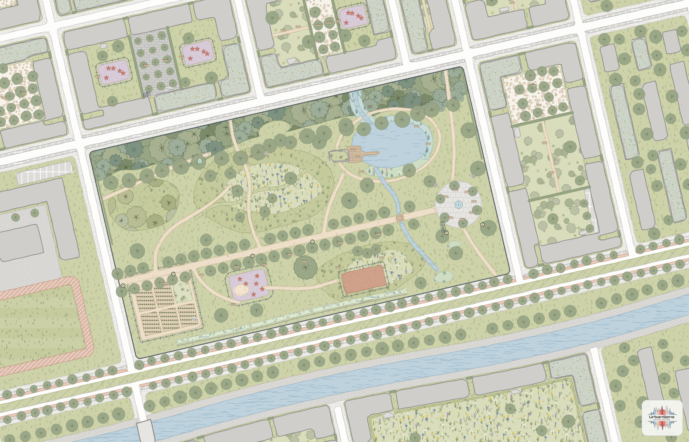
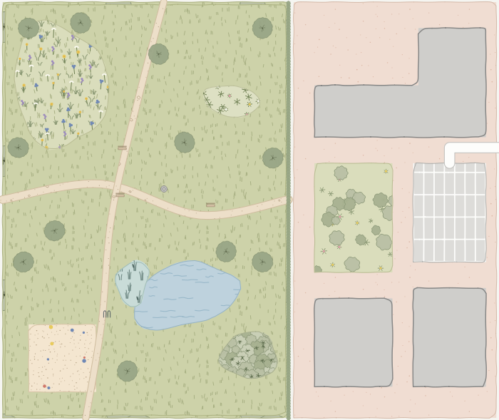
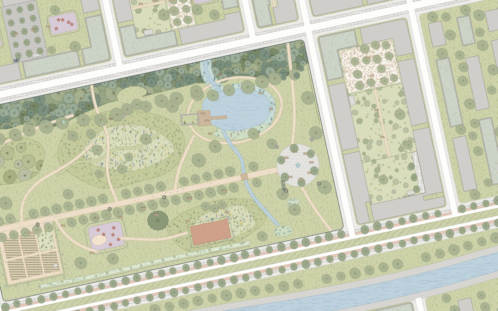
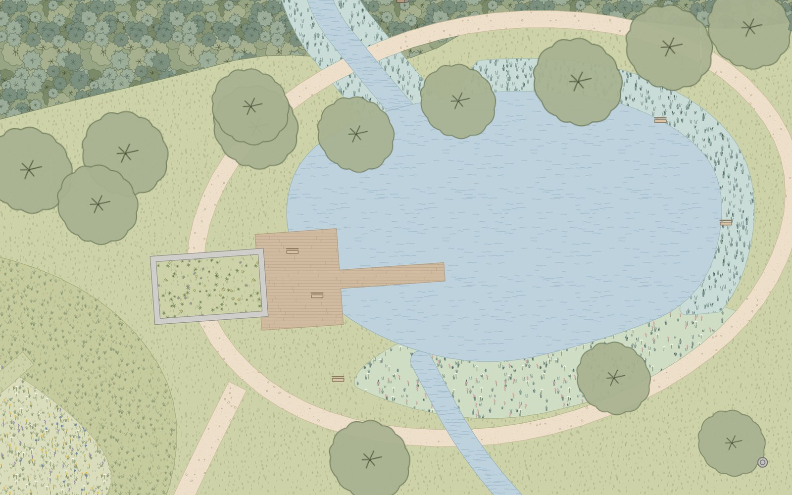
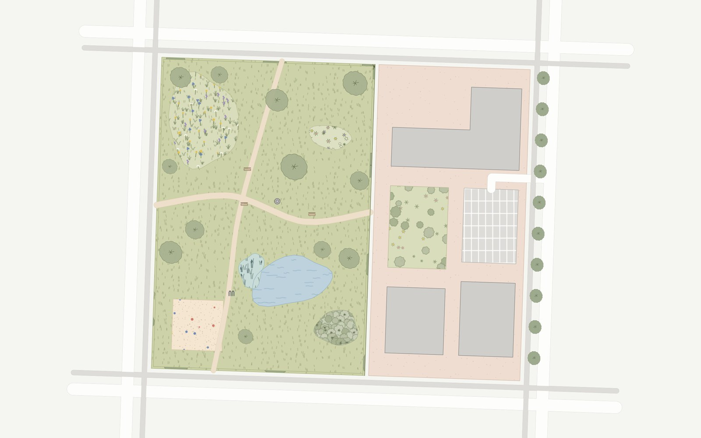

# 5 · GIS and web

*The same style in QGIS, GeoServer, MapLibre, Leaflet and design tools, exported from the one catalog.*

```bash
ulg export all out/            # everything below; or: qgis | sld | web | tokens
```

| Target | Command | You get |
|---|---|---|
| QGIS | `ulg export qgis out/ --lod auto` | layer styles for polygons, lines and points, a style library, a palette |
| GeoServer, MapServer, QGIS Server, INSPIRE view services | `ulg export sld out/` | OGC SLD 1.0 files with pattern tiles and symbols |
| MapLibre GL, Mapbox GL | `ulg export web out/` | sprite, style layers, pattern tiles, tokens, catalog |
| Figma, CSS, apps | `ulg export tokens out/` | CSS custom properties, DTCG design tokens, flat JSON, catalog JSON |

Every export takes `--theme` (`mellow`, `planzv`, `alkis`, `basemap`, `bfn`, `osm`, `mono`) and
`--lang de` for German labels. Your data needs one attribute with element ids (default `element`);
classify it first if it comes in another scheme ([4.5](04-python.md#45-classifying-external-data)).

## 5.1 QGIS



*Headless QGIS render of the demo quarter at 1:2000 with the exported styles: hand-drawn outlines,
detail that follows the map scale, streets and buildings as plain fills.*



*The OSM-style sample in QGIS: the pond, playground and meadow sit on top of the park lawn, and the
footpaths (mapped as lines) are drawn as strips of their `width`.*

**Files**

| File | Use |
|---|---|
| `ulg_polygons.qml`, `ulg_lines.qml`, `ulg_points.qml` | *Layer Properties → Symbology → Style → Load Style…* |
| `ulg_style_library.xml` | *Settings → Style Manager → Import*: every element as a named symbol, for hand styling |
| `ulg_palette.gpl` | colour palette for the colour pickers |

**What the styles do**

- **Textures** are seamless SVG pattern tiles embedded in the file (`base64:`), so the QML needs no
  SVG search path and no plugin.
- **Hand-drawn outline**: a geometry generator applies `wave_randomized()` in paper millimetres,
  seeded by the feature id; the amplitude stays under half the line width, so the ink covers the true
  edge. Needs QGIS 3.24 or later; official themes use exact lines.
- **Level of detail** (`--lod auto`): a rule-based renderer switches textures at 1:750, 1:2 500 and
  1:10 000, exactly like the Python renderer. A fixed `--lod 2` gives a simpler categorized renderer.
- **Trees** are SVG markers sized in map units from `crown_diameter` (or the element default), so
  crowns are true to scale at every zoom.
- **Roads and paths given as centre lines** (OSM highways) are drawn in the lines style as strips of
  their real width: a geometry generator buffers the line by `width`, `lanes` or the `highway` class.
- **Drawing order** follows the catalog bands, then larger areas first (`$area DESC`), so stacked data
  looks as in Python.

Tested by rendering headlessly with PyQGIS 3.36 (`tools/qgis_render.py`); the XML follows what QGIS
writes itself and loads in 3.28 and later. A ready project: `python examples/qgis_project.py`.

## 5.2 OGC SLD for GeoServer and INSPIRE

`ulg export sld out/` writes `ulg_polygons.sld`, `ulg_lines.sld` and `ulg_points.sld`, one `Rule` per
element filtered on the element attribute, with

- a flat `PolygonSymbolizer` fill plus a `GraphicFill` of the element's pattern tile
  (`patterns/<id>.svg`),
- stroke widths converted from millimetres to pixels at 96 dpi, dashes and casings for lines,
- `ExternalGraphic` point symbols (`symbols/<id>.svg`) for pictograms and crowns, well-known marks
  for dots.

SLD cannot express the procedural outline or scale-dependent detail, so the style degrades
gracefully: flat fill, pattern tile, plain outline. That is also the form INSPIRE view services
expect. Upload the folder with its `patterns/` and `symbols/` subfolders into the GeoServer style
directory.

## 5.3 MapLibre GL

<table>
<tr>
<td width="50%"></td>
<td width="50%"></td>
</tr>
<tr>
<td><em>The demo quarter in MapLibre GL, zoom 17.</em></td>
<td><em>Detail at zoom 19: pattern tiles, pond, reed belt and boardwalk.</em></td>
</tr>
</table>



*The OpenStreetMap-style block in MapLibre: stacked areas in the right order, trees sized from
`diameter_crown`, streets and footways drawn in metres from their centre lines.*

`ulg export web out/` writes, among others:

| File | Content |
|---|---|
| `ulg-sprite.png/.json`, `ulg-sprite@2x.png/.json` | pattern tiles `ulg-<id>`, pictograms `ulg-icon-<id>`, crowns `ulg-crown-<id>` |
| `maplibre-layers.json` | style layers to append to your style's `layers` |
| `patterns/*.svg`, `patterns.svg` | the tiles as SVG files and as one `<defs>` sheet |
| `ulg.css`, `ulg.tokens.json`, `ulg-colors.json`, `catalog.json` | tokens and catalog (5.5) |

**Prepare the data** with `to_geojson()`: it writes RFC 7946 GeoJSON in WGS 84 and adds `area_m2`,
which the layers use to draw smaller areas above larger ones.

```python
from ulg.export.web import to_geojson
to_geojson(gdf, "site.geojson", columns=["element", "crown_diameter"])
```

**Use the layers**

```js
const layers = await (await fetch("ulg/maplibre-layers.json")).json();
new maplibregl.Map({
  container: "map",
  style: {
    version: 8,
    sprite: new URL("ulg/ulg-sprite", location.href).href,
    sources: { ulg: { type: "geojson", data: "site.geojson" } },
    layers: [{ id: "paper", type: "background", paint: { "background-color": "#F5F5F1" } }, ...layers]
  }
});
```

| Layer | Draws |
|---|---|
| `ulg-fill`, `ulg-pattern`, `ulg-outline` | flat fills below zoom 15.5, then tiles that carry their own fill colour, so textures stack per feature; outlines. Sorted by z, then area |
| `ulg-strips-casing`, `ulg-strips` | roads and paths given as centre lines, **in metres** at every zoom |
| `ulg-lines` | line elements: hedges, walls, fences, boundaries, ditches |
| `ulg-trees`, `ulg-crowns` | trees as circles in metres below zoom 15, then as drawn crown icons scaled to their real diameter |
| `ulg-points`, `ulg-icons` | dots (sensors, bollards) and pictograms (from zoom 17) |

For vector tiles, pass `source_layer=` to `maplibre_layers()`. Metre-based sizes use the latitude of
your data (`latitude=` in `export_web`). Crown sizes are read from `crown_diameter`, `diameter_crown`,
`kronendurchmesser` and the other size attributes the Python renderer knows. MapLibre cross-fades fill
patterns between zoom levels, so textures are sharpest at whole zoom levels.

**The example.** `examples/web/` is a complete page. Build it and serve it:

```bash
python examples/web/build.py
```

```bash
python -m http.server 8765 --directory examples/web
```

Open <http://localhost:8765> for the demo quarter, or <http://localhost:8765/?data=osm> for the
OpenStreetMap-style block with stacked areas and streets as centre lines. The same page is live at
[urbansens.github.io/Urban-Landscape-Graphics/demo/](https://urbansens.github.io/Urban-Landscape-Graphics/demo/)
(the documentation workflow rebuilds it on every push).
The page is in German by default; add `?lang=en` for English (`/?lang=en&data=osm`).

## 5.4 Leaflet, folium, OpenLayers

Leaflet-style APIs take a style callback with flat colours:

```python
folium.GeoJson(gdf.to_crs(4326), style_function=ulg.style_function()).add_to(m)
```

For textures in SVG-based renderers, include `patterns.svg` (one `<pattern id="ulg-<id>">` per
element) and fill paths with `url(#ulg-lawn)`. OpenLayers and deck.gl can use the sprite PNG and its
JSON index as an atlas.

## 5.5 Design tokens and apps

```bash
ulg export tokens out/
```

| File | Format | For |
|---|---|---|
| `ulg.css` | CSS custom properties (`--ulg-grass-300`, `--ulg-lawn-fill`, `--ulg-lawn-ink` …) | web apps, the example page |
| `ulg.tokens.json` | W3C Design Tokens Community Group format | Figma (Tokens Studio), Style Dictionary |
| `ulg-colors.json` | flat `{token: hex}` | any tool |
| `catalog.json` | the full catalog: elements, names, colours, attributes | apps, dashboards, agents |

## 5.6 Print and illustration

SVG output is laid out in millimetres at the map scale: open it in Inkscape, Illustrator or Affinity
and it is true to size. Every feature group carries `data-element="<id>"`, so layers can be selected
and restyled by element. For PDF:

```bash
inkscape plan.svg --export-type=pdf
```

---

Next: [6 · Standards and conformance](06-standards.md)
