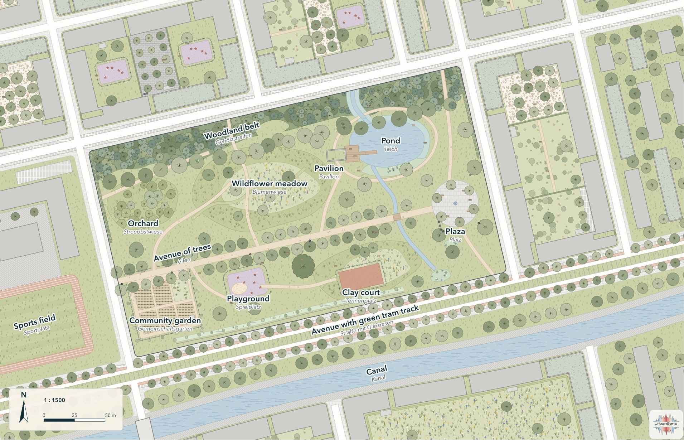

# Urban Landscape Graphics: documentation

<!-- github-only:start -->
*The documentation is written in German (the default) and English. This is the English version; the German one starts at [../index.md](../index.md).*

<!-- github-only:end -->
*The UrbanSens Ecological Vector Style as a library: one catalog of colours, textures and symbols for
urban landscape maps, tied to German and European standards, with renderers for Python and exporters
for QGIS, GeoServer, the web and design tools.*

## Chapters

| | Chapter | What you find there |
|---|---|---|
| 1 | [Origins](01-origins.md) | where the look comes from: the Englischer Garten, the Bavarian survey of 1808, Lenné's plans, PlanZV, OpenStreetMap, the EU Nature Restoration Regulation and the UrbanSens brief |
| 2 | [The style guide](02-style.md) | principles, palette, textures, lines, symbols, levels of detail, drawing order, legibility, themes, do and don't |
| 3 | [The catalog](03-catalog.md) | the 173 elements, what an element is made of, the coefficients they carry |
| 4 | [Python](04-python.md) | install, look-ups, classifying data, drawing SVG and Matplotlib maps, legends, sheets, OSM data, site figures, the command line |
| 5 | [GIS and web](05-gis-and-web.md) | QGIS styles, OGC SLD for GeoServer, MapLibre sprites and layers, Leaflet, design tokens, print |
| 6 | [Standards](06-standards.md) | what "conform" means, themes, the 26 crosswalks, coefficients, drawing conventions, deliberate departures |
| 7 | [For AI agents](07-agents.md) | the agent skill, the rules agents follow, JSON output, example requests |
| 8 | [Extending](08-extending.md) | adding elements, colours, motifs, themes and crosswalks; checks, tools, versions |

## As HTML

The same pages as a browsable site with search and light/dark mode, in English at
**[urbansens.github.io/Urban-Landscape-Graphics/en/](https://urbansens.github.io/Urban-Landscape-Graphics/en/)** and in German (the
default) at [urbansens.github.io/Urban-Landscape-Graphics](https://urbansens.github.io/Urban-Landscape-Graphics/). Each language is also
one self-contained file for e-mail and offline reading
([English](https://urbansens.github.io/Urban-Landscape-Graphics/en/ulg-documentation.html),
[German](https://urbansens.github.io/Urban-Landscape-Graphics/ulg-dokumentation.html)). All of it is generated by
`python tools/build_html.py` (into `docs/html/`); GitHub runs it on every push and publishes the result with GitHub Pages.

## Reference

| Page | Content |
|---|---|
| [Element list](../reference/element-list.md) | every element id with names, aliases and description (generated) |
| [Attributes](../reference/attributes.md) | coefficients per element and their sources (generated) |
| [Crosswalks](../reference/crosswalks.md) | the 26 schemes with coverage, sources and notes (generated) |
| [Themes](../reference/themes.md) | the seven themes with sources and evidence (generated) |
| [API](../reference/api.md) | functions, classes and the command line (generated) |
| [Crosswalk format](../reference/crosswalk-format.md) | how to write a crosswalk file |
| [Standards report](../research/standards-report.md) | the synthesis of the standards research: findings, conformance matrix, open points |
| [Research streams](../research/streams/) | the seven detailed research files behind the report |

## Project

| Page | Content |
|---|---|
| [Licence and credit](licence-and-credit.md) | the MIT licence, how to credit UrbanSens, the mark on the sheets, the logos, third-party material |
| [Changelog](../../CHANGELOG.md) | what changed in each version |
| [Working on ulg](../../AGENTS.md) | rules and commands for contributors and coding agents |

## Reading paths

- **I want a map now** → [4.1 Install](04-python.md#41-install), [4.4 Drawing](04-python.md#44-drawing),
  [`examples/quickstart.py`](../../examples/quickstart.py)
- **I work in QGIS** → [5.1 QGIS](05-gis-and-web.md#51-qgis), [`examples/qgis_project.py`](../../examples/qgis_project.py)
- **I build a web app** → [5.3 MapLibre](05-gis-and-web.md#53-maplibre-gl), [5.5 Tokens](05-gis-and-web.md#55-design-tokens-and-apps),
  [`examples/web/`](../../examples/web/)
- **I have OSM, ALKIS or CORINE data** → [4.5 Classifying](04-python.md#45-classifying-external-data),
  [`examples/osm_workflow.py`](../../examples/osm_workflow.py)
- **I need numbers (BFF, sealing, runoff, green space)** → [4.7 Site figures](04-python.md#47-site-figures),
  [`examples/indicators.py`](../../examples/indicators.py)
- **I design the style** → [2 · Style guide](02-style.md), [8 · Extending](08-extending.md)
- **I am an AI agent** → [7 · For AI agents](07-agents.md), `ulg agent`
